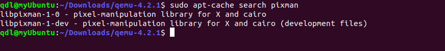

## 操作系统实验lab0


目录：

[TOC]

## 实验目的

- 了解操作系统开发实验环境
- 熟悉命令行方式的编译、调试工程
- 掌握基于硬件模拟器的调试技术
- 熟悉C语言编程和指针的概念
- 了解X86汇编语言


## 工具仓库

- [x] 操作系用：Ubuntu 20.04 LTS，原生
- [x] shell命令：ls,pwd,tree,rm,cd,mv......
- [x] 版本维护：apt，git
- [x] 代码编辑：VsCode，vim
- [x] 源码对比：diff,meld
- [x] 编译调试：gcc，gdb，make
- [x] 硬件模拟：qemu

- 安装结果：

```bash
$ apt --version
apt 2.0.2ubuntu0.1 (amd64)

$ git --version
git version 2.25.1

$ diff --version
diff (GNU diffutils) 3.7

$ meld --version
meld 3.20.2

$ gcc --version
gcc (Ubuntu 9.3.0-17ubuntu1~20.04) 9.3.0

$ gdb --version
GNU gdb (Ubuntu 9.2-0ubuntu1~20.04) 9.2
```


```bash
$ sudo apt install meld
$ meld --version
```


### qemu安装

当然是最新版本啦

- 官网：https://www.qemu.org/download/
- 文件仓库：https://download.qemu.org/


```bash
$ tar xvJf qemu-4.2.1.tar.xz 
$ cd qemu-4.2.1
$ sudo ./configure --target-list=i386-softmmu
$ sudo make
$ sudo make install
#报错信息：

$ apt-get cache search pixman				# 在仓库中查找pixman
```

 

```bash
$ sudo apt install libpixman-1-dev
```

- 安装：

```bash
$ sudo make
$ sudo make install
```

 

 

- 软连

```bash
qdl@myUbuntu:/usr/local/bin$ sudo ln -s /usr/local/bin/qemu-system-i386 /usr/bin/qemu
qdl@myUbuntu:/usr/local/bin$ qemu --version
```


## vim配置

```bash
$ apt intstall vim
$ vim ~/.vimrc

set nocompatible
set encoding=utf-8
set fileencodings=utf-8,chinese
set tabstop=4
set cindent shiftwidth=4
set backspace=indent,eol,start
autocmd Filetype c set omnifunc=ccomplete#Complete
autocmd Filetype cpp set omnifunc=cppcomplete#Complete
set incsearch
set number
set display=lastline
set ignorecase
syntax on
set nobackup
set ruler
set showcmd
set smartindent
set hlsearch
set cmdheight=1
set laststatus=2
set shortmess=atI
set formatoptions=tcrqn
set autoindent  

:wq
```


```bash
:wq
$ source ~/.vimrc
```


## ucore源代码下载

- `gitclone`

```bash
$ git clone -b master  https://github.com/chyyuu/os_kernel_lab.git
```

- `切换分支`

```bash
$ git branch -a										# 查看所有的分支
$ git checkout remotes/origin/master				# 切换master
之前的 HEAD 位置是 f2fa0b7 Update README.md
HEAD 目前位于 b12d4b9 Update README.md
```


## gcc 基本规则：

- 参考网址：https://man.linuxde.net/gcc

| -o    | 指定生成的输出文件             |
| ----- | ------------------------------ |
| -E    | 仅执行编译预处理               |
| -S    | 将C代码转换为汇编代码          |
| -wall | 显示警告信息                   |
| -c    | 仅执行编译操作，不进行连接操作 |


### AT&T汇编基本语法

Ucore中用到的是AT&T格式的汇编，与Intel格式的汇编有一些不同。

- 参考网址：https://chyyuu.gitbooks.io/ucore_os_docs/content/lab0/lab0_2_3_1_2_att_asm.html


### GCC基本内联汇编

GCC 提供了两内内联汇编语句（inline asm statements）：基本内联汇编语句（basic inline asm statement)和扩展内联汇编语句（extended inline asm statement）。GCC基本内联汇编很简单，一般是按照下面的格式：

- 参考网址：https://chyyuu.gitbooks.io/ucore_os_docs/content/lab0/lab0_2_3_1_3_gcc_inline_asm.html


### GCC扩展内联汇编

- 参考网址：https://chyyuu.gitbooks.io/ucore_os_docs/content/lab0/lab0_2_3_1_4_extend_gcc_asm.html


## gdb基本规则：

- 参考网址：https://chyyuu.gitbooks.io/ucore_os_docs/content/lab0/lab0_2_3_3_gdb.html


- 设置断点
- 监视程序变量的值
- 程序的单步(step in/step over)执行
- 显示/修改变量的值
- 显示/修改寄存器
- 查看程序的堆栈情况
- 远程调试
- 调试线程


## Makfile 和makefile

GNU make(简称make)是一种代码维护工具，在大中型项目中，它将根据程序各个模块的更新情况，自动的维护和生成目标代码。

- 参考博客：[我的个人博客/飞翔的哈士奇](https://blog.csdn.net/weixin_44307065/article/details/109128403?ops_request_misc=%257B%2522request%255Fid%2522%253A%2522160592544919724835816177%2522%252C%2522scm%2522%253A%252220140713.130102334.pc%255Fblog.%2522%257D&request_id=160592544919724835816177&biz_id=0&utm_medium=distribute.pc_search_result.none-task-blog-2~blog~first_rank_v1~rank_blog_v1-1-109128403.pc_v1_rank_blog_v1&utm_term=makefile&spm=1018.2118.3001.4450)

- 基本规则：

```
target ... : prerequisites ...
    command
    ...
    ...
```

target也就是一个目标文件，可以是object file，也可以是执行文件。还可以是一个标签（label）。prerequisites就是，要生成那个target所需要的文件或是目标。command也就是make需要执行的命令（任意的shell命令）。 这是一个文件的依赖关系，也就是说，target这一个或多个的目标文件依赖于prerequisites中的文件，其生成规则定义在 command中。如果prerequisites中有一个以上的文件比target文件要新，那么command所定义的命令就会被执行。这就是makefile的规则。也就是makefile中最核心的内容。


## 使用硬件模拟器QEMU

- 参考网址：https://chyyuu.gitbooks.io/ucore_os_docs/content/lab0/lab0_2_4_2_1_qemu_runtime_arguments.html

qemu 运行可以有多参数，格式如：

```
qemu [options] [disk_image]
```

- 在实验中，例如 lab1，可能用到的命令如：

```
qemu -hda ucore.img -parallel stdio        # 让ucore在qemu模拟的x86硬件环境中执行
```

或

```
qemu -S -s -hda ucore.img -monitor stdio    # 用于与gdb配合进行源码调试
```

- 常用调试命令：https://chyyuu.gitbooks.io/ucore_os_docs/content/lab0/lab0_2_4_2_2_qemu_monitor_debug.html