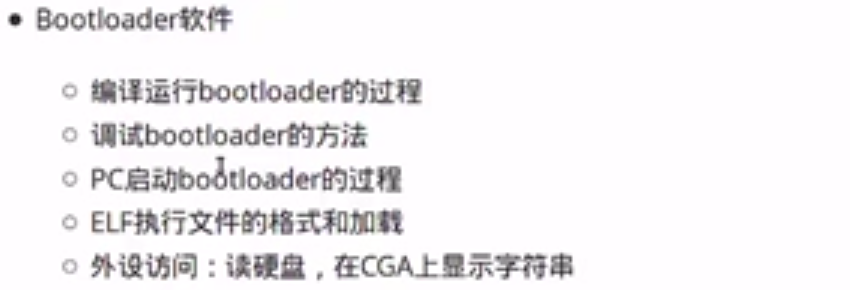
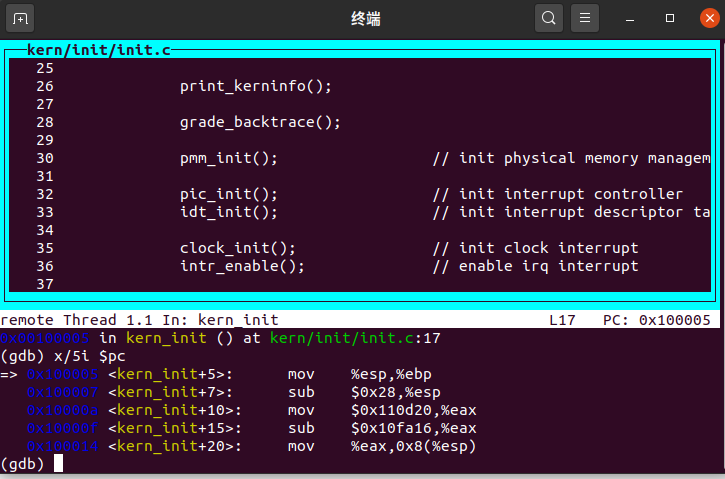
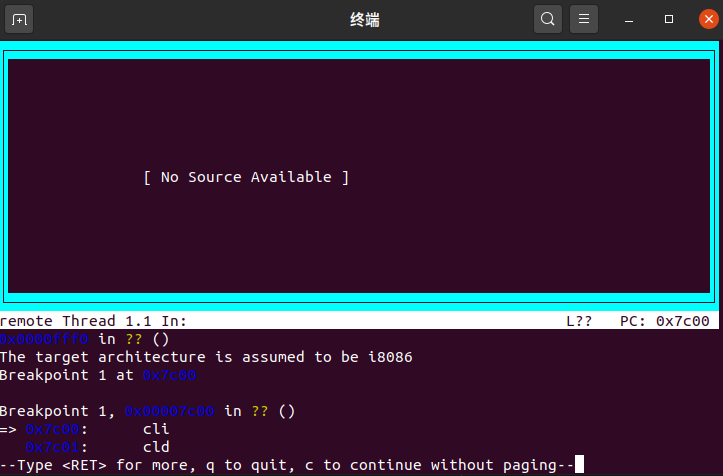
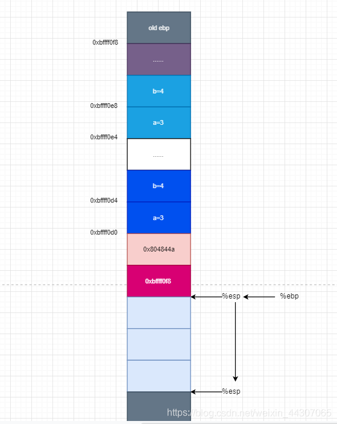
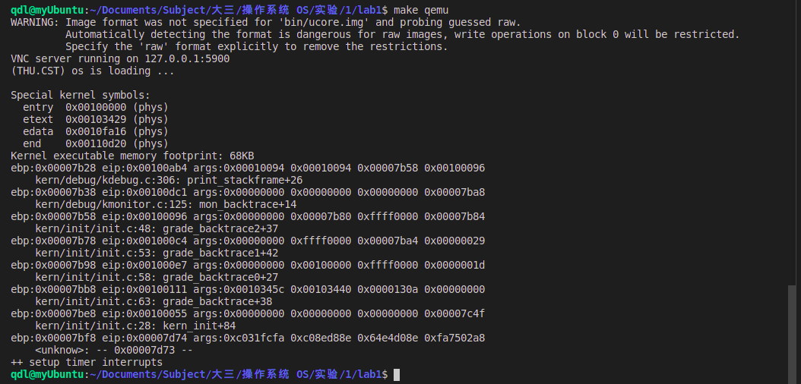
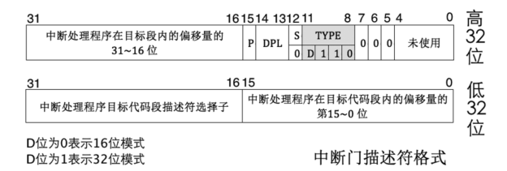
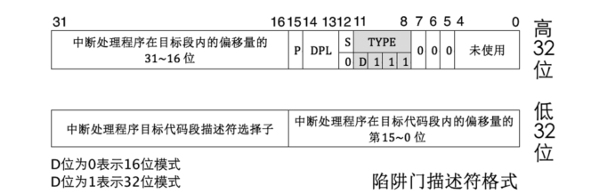
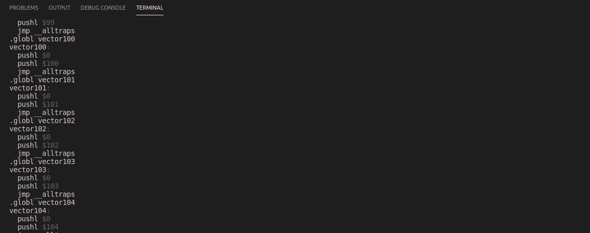
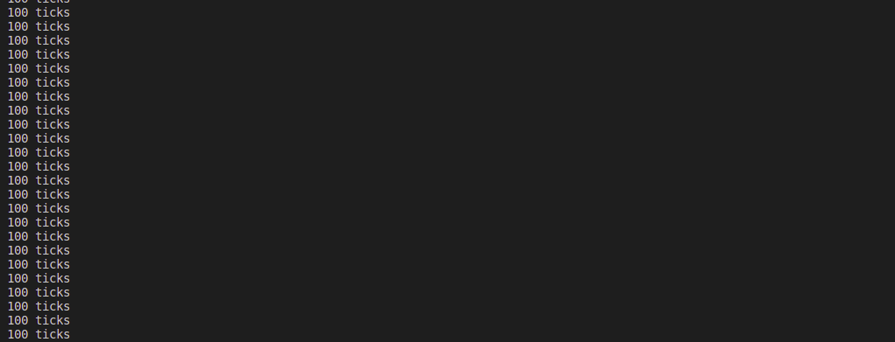

## 操作系统实验1

目录：

[TOC]


## 参考地址

- **bendWang**：https://blog.csdn.net/qq_19876131/article/details/51706973?utm_medium=distribute.pc_relevant.none-task-blog-BlogCommendFromMachineLearnPai2-3.control&depth_1-utm_source=distribute.pc_relevant.none-task-blog-BlogCommendFromMachineLearnPai2-3.control

- GTag：https://blog.csdn.net/tiu2014/article/details/53998595
- 天天看博客：https://blog.csdn.net/weixin_45097312/article/details/102578586

## BIOS

基本输入输出系统(basic inputoutput system)；计算机系统中负责基本的输入输出操作的模块。通常被固化在只读存储器中，以中断调用方式为上层软件提供服务。属于[**计算机科学技术**](https://www.xuetangx.com/learn/THU08091000267/THU08091000267/4231154/video/6287031)领域，其先修概念有[**软件**](https://www.xuetangx.com/learn/THU08091000267/THU08091000267/4231154/video/6287031)、[**计算机科学**](https://www.xuetangx.com/learn/THU08091000267/THU08091000267/4231154/video/6287031)、[**计算机技术**](https://www.xuetangx.com/learn/THU08091000267/THU08091000267/4231154/video/6287031)等，后修概念有[**服务器**](https://www.xuetangx.com/learn/THU08091000267/THU08091000267/4231154/video/6287031)等。概念延伸：[**研究bios的学者**](https://www.xuetangx.com/learn/THU08091000267/THU08091000267/4231154/video/6287031)。


## ucore 代码编译

(1) 编译过程：在解压缩后的 ucore 源码包中使用 make 命令即可。例如 lab1中：

```bash
$  make
```

在lab1目录下的bin目录中，生成一系列的目标文件：

- ucore.img：被qemu访问的虚拟硬盘文件
- kernel: ELF格式的toy ucore kernel执行文件，被嵌入到了ucore.img中
- bootblock: 虚拟的硬盘主引导扇区（512字节），包含了bootloader执行代码，被嵌入到了ucore.img中
- sign：外部执行程序，用来生成虚拟的硬盘主引导扇区

还生成了其他很多文件，这里就不一一列举了。


(2) 保存修改：

使用 diff 命令对修改后的 ucore 代码和 ucore 源码进行比较，比较之前建议使用 make clean 命令清除不必要文件。(如果有ctags 文件，需要手工清除。)


(3)应用修改：参见 patch 命令说明。


## 实验内容 bootloader

lab1中包含一个bootloader和一个OS。

- 这个bootloader可以切换到X86保护模式
- 能够读磁盘并加载ELF执行文件格式，并显示字符。
- lab1中的OS只是一个可以处理时钟中断和显示字符的幼儿园级别OS。

 

## 实验报告要求

对实验报告的要求：

- 基于markdown格式来完成，以文本方式为主。
- 填写各个基本练习中要求完成的报告内容
- 完成实验后，请分析ucore_lab中提供的参考答案，并请在实验报告中说明你的实现与参考答案的区别
- 列出你认为本实验中重要的知识点，以及与对应的OS原理中的知识点，并简要说明你对二者的含义，关系，差异等方面的理解（也可能出现实验中的知识点没有对应的原理知识点）
- 列出你认为OS原理中很重要，但在实验中没有对应上的知识点


## lab1目录结构

在lab1目录下的bin目录中，生成一系列的目标文件：

- ucore.img：被qemu访问的虚拟硬盘文件
- kernel: ELF格式的toy ucore kernel执行文件，被嵌入到了ucore.img中
- bootblock: 虚拟的硬盘主引导扇区（512字节），包含了bootloader执行代码，被嵌入到了ucore.img中
- sign.c：外部执行程序，用来生成虚拟的硬盘主引导扇区

还生成了其他很多文件，这里就不一一列举了。


## 练习1

理解通过make生成执行文件的过程。（要求在报告中写出对下述问题的回答）

列出本实验各练习中对应的OS原理的知识点，并说明本实验中的实现部分如何对应和体现了原理中的基本概念和关键知识点。

在此练习中，大家需要通过静态分析代码来了解：

1. 操作系统镜像文件ucore.img是如何一步一步生成的？(需要比较详细地解释Makefile中每一条相关命令和命令参数的含义，以及说明命令导致的结果)
2. 一个被系统认为是符合规范的硬盘主引导扇区的特征是什么？

- 了解make执行了哪些命令，可以执行：


```
$ make "V="
```

- 获取更多有关make的信息，可上网查询，并请执行


```
$ man make
```

### 解答1.1

- 关闭编译警告以方便查看编译指令信息

```bash
# 打开makefile，将-Wall修改为-w，关闭所有警告，这一步看起来似乎很愚蠢，但实际上我们已经保证了代码运行无误，因此这是一个聪明的选择
-Wall -----> -w
```

- 执行`make V=`，查看编译过程：

```bash
$ make V=
```

- 生成ucore.img的相关代码：

```bash
bin/ucore.img
| 生成ucore.img的相关代码为
| $(UCOREIMG): $(kernel) $(bootblock)
|	$(V)dd if=/dev/zero of=$@ count=10000
|	$(V)dd if=$(bootblock) of=$@ conv=notrunc
|	$(V)dd if=$(kernel) of=$@ seek=1 conv=notrunc
|
| 为了生成ucore.img，首先需要生成bootblock、kernel
	首先先创建一个大小为10000字节的块儿，然后再将bootblock拷贝过去。
	生成ucore.img需要先生成kernel和bootblock
```

- 生成bootblock的相关代码为

```bash
|>	bin/bootblock
|	| 生成bootblock的相关代码为
|	| $(bootblock): $(call toobj,$(bootfiles)) | $(call totarget,sign)
|	|	@echo + ld $@
|	|	$(V)$(LD) $(LDFLAGS) -N -e start -Ttext 0x7C00 $^ \
|	|		-o $(call toobj,bootblock)
|	|	@$(OBJDUMP) -S $(call objfile,bootblock) > \
|	|		$(call asmfile,bootblock)
|	|	@$(OBJCOPY) -S -O binary $(call objfile,bootblock) \
|	|		$(call outfile,bootblock)
|	|	@$(call totarget,sign) $(call outfile,bootblock) $(bootblock)
|	|
|	| 为了生成bootblock，首先需要生成bootasm.o、bootmain.o、sign
```

- 生成`bootasm.o / bootmain.o`

```bash
|	|>	obj/boot/bootasm.o, obj/boot/bootmain.o
|	|	| 生成bootasm.o,bootmain.o的相关makefile代码为
|	|	| bootfiles = $(call listf_cc,boot) 
|	|	| $(foreach f,$(bootfiles),$(call cc_compile,$(f),$(CC),\
|	|	|	$(CFLAGS) -Os -nostdinc))
|	|	| 实际代码由宏批量生成
|	|	| 
|	|	| 生成bootasm.o需要bootasm.S
|	|	| 实际命令为
|	|	| gcc -Iboot/ -fno-builtin -Wall -ggdb -m32 -gstabs \
|	|	| 	-nostdinc  -fno-stack-protector -Ilibs/ -Os -nostdinc \
|	|	| 	-c boot/bootasm.S -o obj/boot/bootasm.o
|	|	| 其中关键的参数为
|	|	| 	-ggdb  生成可供gdb使用的调试信息。这样才能用qemu+gdb来调试bootloader or ucore。
|	|	|	-m32  生成适用于32位环境的代码。我们用的模拟硬件是32bit的80386，所以ucore也要是32位的软件。
|	|	| 	-gstabs  生成stabs格式的调试信息。这样要ucore的monitor可以显示出便于开发者阅读的函数调用栈信息
|	|	| 	-nostdinc  不使用标准库。标准库是给应用程序用的，我们是编译ucore内核，OS内核是提供服务的，所以所有的服务要自给自足。
|	|	|	-fno-stack-protector  不生成用于检测缓冲区溢出的代码。这是for 应用程序的，我们是编译内核，ucore内核好像还用不到此功能。
|	|	| 	-Os  为减小代码大小而进行优化。根据硬件spec，主引导扇区只有512字节，我们写的简单bootloader的最终大小不能大于510字节。
|	|	| 	-I<dir>  添加搜索头文件的路径
|	|	| 
|	|	| 生成bootmain.o需要bootmain.c
|	|	| 实际命令为
|	|	| gcc -Iboot/ -fno-builtin -Wall -ggdb -m32 -gstabs -nostdinc \
|	|	| 	-fno-stack-protector -Ilibs/ -Os -nostdinc \
|	|	| 	-c boot/bootmain.c -o obj/boot/bootmain.o
|	|	| 新出现的关键参数有
|	|	| 	-fno-builtin  除非用__builtin_前缀，
|	|	|	              否则不进行builtin函数的优化
```

-  生成`sign`

```bash
|	|>	bin/sign
|	|	| 生成sign工具的makefile代码为
|	|	| $(call add_files_host,tools/sign.c,sign,sign)
|	|	| $(call create_target_host,sign,sign)
|	|	| 
|	|	| 实际命令为
|	|	| gcc -Itools/ -g -Wall -O2 -c tools/sign.c \
|	|	| 	-o obj/sign/tools/sign.o
|	|	| gcc -g -Wall -O2 obj/sign/tools/sign.o -o bin/sign
```

- 生成`bootblock.o`

```bash
|	| 首先生成bootblock.o
|	| ld -m    elf_i386 -nostdlib -N -e start -Ttext 0x7C00 \
|	|	obj/boot/bootasm.o obj/boot/bootmain.o -o obj/bootblock.o
|	| 其中关键的参数为
|	|	-m <emulation>  模拟为i386上的连接器
|	|	-nostdlib  不使用标准库
|	|	-N  设置代码段和数据段均可读写
|	|	-e <entry>  指定入口
|	|	-Ttext  制定代码段开始位置
```

- 拷贝二进制代码bootblock.o到bootblock.out

```bash
|	| 拷贝二进制代码bootblock.o到bootblock.out
|	| objcopy -S -O binary obj/bootblock.o obj/bootblock.out
|	| 其中关键的参数为
|	|	-S  移除所有符号和重定位信息
|	|	-O <bfdname>  指定输出格式
```

- 使用sign工具处理bootblock.out，生成bootblock

```bash
|	| 使用sign工具处理bootblock.out，生成bootblock
|	| bin/sign obj/bootblock.out bin/bootblock
```

- 生成`kernel`

```bash
|>	bin/kernel
|	| 生成kernel的相关代码为
|	| $(kernel): tools/kernel.ld
|	| $(kernel): $(KOBJS)
|	| 	@echo + ld $@
|	| 	$(V)$(LD) $(LDFLAGS) -T tools/kernel.ld -o $@ $(KOBJS)
|	| 	@$(OBJDUMP) -S $@ > $(call asmfile,kernel)
|	| 	@$(OBJDUMP) -t $@ | $(SED) '1,/SYMBOL TABLE/d; s/ .* / /; \
|	| 		/^$$/d' > $(call symfile,kernel)
|	| 
|	| 为了生成kernel，首先需要 kernel.ld init.o readline.o stdio.o kdebug.o
|	|	kmonitor.o panic.o clock.o console.o intr.o picirq.o trap.o
|	|	trapentry.o vectors.o pmm.o  printfmt.o string.o
|	| kernel.ld已存在
```

- 生成这些.o文件的相关makefile代码为

```bash
|	|>	obj/kern/*/*.o 
|	|	| 生成这些.o文件的相关makefile代码为
|	|	| $(call add_files_cc,$(call listf_cc,$(KSRCDIR)),kernel,\
|	|	|	$(KCFLAGS))
|	|	| 这些.o生成方式和参数均类似，仅举init.o为例，其余不赘述
|	|>	obj/kern/init/init.o
|	|	| 编译需要init.c
|	|	| 实际命令为
|	|	|	gcc -Ikern/init/ -fno-builtin -Wall -ggdb -m32 \
|	|	|		-gstabs -nostdinc  -fno-stack-protector \
|	|	|		-Ilibs/ -Ikern/debug/ -Ikern/driver/ \
|	|	|		-Ikern/trap/ -Ikern/mm/ -c kern/init/init.c \
|	|	|		-o obj/kern/init/init.o
```

- 生成kernel时，makefile的几条指令中有@前缀的都不必需

```bash
|	| 生成kernel时，makefile的几条指令中有@前缀的都不必需
|	| 必需的命令只有
|	| ld -m    elf_i386 -nostdlib -T tools/kernel.ld -o bin/kernel \
|	| 	obj/kern/init/init.o obj/kern/libs/readline.o \
|	| 	obj/kern/libs/stdio.o obj/kern/debug/kdebug.o \
|	| 	obj/kern/debug/kmonitor.o obj/kern/debug/panic.o \
|	| 	obj/kern/driver/clock.o obj/kern/driver/console.o \
|	| 	obj/kern/driver/intr.o obj/kern/driver/picirq.o \
|	| 	obj/kern/trap/trap.o obj/kern/trap/trapentry.o \
|	| 	obj/kern/trap/vectors.o obj/kern/mm/pmm.o \
|	| 	obj/libs/printfmt.o obj/libs/string.o
|	| 其中新出现的关键参数为
|	|	-T <scriptfile>  让连接器使用指定的脚本
```

- 生成块文件，填充

```bash
| 生成一个有10000个块的文件，每个块默认512字节，用0填充
| dd if=/dev/zero of=bin/ucore.img count=10000
| 把bootblock中的内容写到第一个块
| dd if=bin/bootblock of=bin/ucore.img conv=notrunc
| 从第二个块开始写kernel中的内容
| dd if=bin/kernel of=bin/ucore.img seek=1 conv=notrunc
```

- 因此整个执行顺序就是：

```bash
gcc 源文件　-o 目标文件

ld 把目标文件　转换为可执行程序:
		- kernel: ELF格式的toy ucore kernel执行文件，被嵌入到了ucore.img中
		- bootblock: 虚拟的硬盘主引导扇区（512字节），包含了bootloader执行代码，被嵌入到了ucore.img中
		- sign:	外部执行程序，用来生成虚拟的硬盘主引导扇区
dd 把可执行文件加载到虚拟硬盘中去uCore.img
```


###　解答1.２

一个被系统认为是符合规范的硬盘主引导扇区的特征是什么?	`./tools/sign.c`

```c
char buf[512];                          //一个磁盘主引导扇区只有512字节。且
memset(buf, 0, sizeof(buf));
FILE *ifp = fopen(argv[1], "rb");
int size = fread(buf, 1, st.st_size, ifp);
if (size != st.st_size) {
    fprintf(stderr, "read '%s' error, size is %d.\n", argv[1], size);
    return -1;
}
fclose(ifp);
buf[510] = 0x55;                        //第510个（倒数第二个）字节是0x55
buf[511] = 0xAA;                        //第511个（倒数第一个）字节是0xAA
```

- 通过查看整个外部执行程序sign.c(用来生成虚拟的硬盘主引导扇区)

```
从sign.c的代码来看，一个磁盘主引导扇区只有512字节。且
第510个（倒数第二个）字节是0x55				
第511个（倒数第一个）字节是0xAA
```


## 练习2

1. 从CPU加电后执行的第一条指令开始，单步跟踪BIOS的执行。
2. 在初始化位置0x7c00设置实地址断点,测试断点正常。
3. 从0x7c00开始跟踪代码运行,将单步跟踪反汇编得到的代码与bootasm.S和 bootblock.asm进行比较。
4. 自己找一个bootloader或内核中的代码位置，设置断点并进行测试。


使用qemu执行并调试lab1中的软件。（要求在报告中简要写出练习过程）

```bash
gdb能识别的命令
file bin/kernel			# 加载bin/kernel
target remote :1234		# 与qemu进行链接(TRP)
break kern_init			# 刚开始是BIOS是进入8086的6位实模式的方式,直到启动之后把BootLoder加载进去,把控制权交给bootloader
continue
```


### 解答2.1

从CPU加电后执行的第一条指令开始，单步跟踪BIOS的执行。

- 修改 lab1/tools/gdbinit,内容为:

```bash
set architecture i8086	# BIOS是进入8086的6位实模式的方式
target remote :1234		# gdbserver 远程调试 On the target machine
```

- 执行

```bash
$ make debug
```

> 为什么可以debug? -----查看makefile

```makefile
debug: $(UCOREIMG)
	$(V)$(QEMU) -S -s -parallel stdio -hda $< -serial null &
	$(V)sleep 2
	$(V)$(TERMINAL) -e "gdb -q -tui -x tools/gdbinit"
```

查看之后发现debug目标使用qemu追踪记录,  debug使用gdb加载了初始化文件.

- 执行`si`单步跟踪

```bash
$ si
```

- 通过`x/n i`如下命令来看BIOS的代码

```bash
$ x /5i $pc
```

 

- 改写`makefile`

在调用qemu时增加`-d in_asm -D q.log`参数，便可以将运行的汇编指令保存在q.log中。
为防止qemu在gdb连接后立即开始执行，删除了`tools/gdbinit`中的`continue`行。

```bash
vim Makefile:
	debug: $(UCOREIMG)
		$(V)$(TERMINAL) -e "$(QEMU) -S -s -d in_asm -D $(BINDIR)/q.log -parallel stdio -hda $< -serial null"
		$(V)sleep 2
		$(V)$(TERMINAL) -e "gdb -q -tui -x tools/gdbinit"
```

### 解答2.2

在初始化位置0x7c00设置实地址断点,测试断点正常。

- 将tools/gdbinit改为:

```c
file bin/kernel			//加载kernel符号信息,Ucore信息
target remote :1234		//远程调试与qemu对接
set architecture i8086  //设置当前调试的CPU是8086
b *0x7c00  				//在0x7c00处设置断点。此地址是bootloader入口点地址，可看boot/bootasm.S的start地址处
c          				//continue简称，表示继续执行
x /2i $pc  				//显示当前eip处的汇编指令
set architecture i386  	//设置当前调试的CPU是80386
```

- 运行`make debug`便可得到:

可以看到在qemu启动之后,PC中断在0x7c00的位置.

 


### 解答2.3

从0x7c00开始跟踪代码运行,将单步跟踪反汇编得到的代码与bootasm.S和 bootblock.asm进行比较。

- 将tools/gdbinit改为:

```bash
file bin/kernel
target remote :1234
break kern_init
continue
b *0x7c00
c
x /10i $pc
```

- 执行`make debug`

```asm
IN: 
0x00007c00:  fa                       cli      
0x00007c01:  fc                       cld      
0x00007c02:  31 c0                    xorw     %ax, %ax
0x00007c04:  8e d8                    movw     %ax, %ds
0x00007c06:  8e c0                    movw     %ax, %es
0x00007c08:  8e d0                    movw     %ax, %ss

----------------
IN: 
0x00007c0a:  e4 64                    inb      $0x64, %al

----------------


...................省略

----------------
IN: 
0x00007c45:  bc 00 7c 00 00           movl     $0x7c00, %esp
0x00007c4a:  e8 c0 00 00 00           calll    0x7d0f

----------------
```

其与bootasm.S和bootblock.asm中的代码相同。


### 解答2.4

自己找一个bootloader或内核中的代码位置，设置断点并进行测试。

```bash
file bin/kernel
target remote :1234
break kern_init
continue
b *0x8c00				# 断点位置换掉
c
x /10i $pc
```


## 练习3

分析bootloader 进入保护模式的过程。

BIOS将通过读取硬盘主引导扇区到内存,并转跳到相应内存中的位置执行bootloader,.

提示：需要阅读**保护模式和分段机制”**和lab1/boot/bootasm.S源码，了解如何从实模式切换到保护模式，需要了解：

- 为何开启A20，以及如何开启A20
- 如何初始化GDT表
- 如何使能和进入保护模式


### 解答

- 保护模式+分段机制:https://chyyuu.gitbooks.io/ucore_os_docs/content/lab1/lab1_3_2_1_protection_mode.html
- A20:https://chyyuu.gitbooks.io/ucore_os_docs/content/lab1/lab1_appendix_a20.html

```
Intel 80386只有在进入保护模式后，才能充分发挥其强大的功能，提供更好的保护机制和更大的寻址空间，否则仅仅是一个快速的8086而已

bootloader设计中，涉及到了从实模式到保护模式的处理，我们的操作系统功能（比如分页机制）是建立在Intel 80386的保护模式上来设计的

(1) 实模式

(2) 保护模式

(3) 分段存储管理机制
```


- 查看lab1/boot/bootasm.S源码:

从`%cs=0 $pc=0x7c00`，进入后

- 首先清理环境：包括将flag置0和将段寄存器置0

```asm
.code16
cli				# 关闭中断
cld
xorw %ax, %ax
movw %ax, %ds
movw %ax, %es
movw %ax, %ss
```

- 开启A20：通过将键盘控制器上的A20线置于高电位，全部32条地址线可用，
  可以访问4G的内存空间。

```asm
seta20.1:               # 等待8042键盘控制器不忙
inb $0x64, %al      # 
testb $0x2, %al     #
jnz seta20.1        #

movb $0xd1, %al     # 发送写8042输出端口的指令
outb %al, $0x64     #

seta20.1:               # 等待8042键盘控制器不忙
inb $0x64, %al      # 
testb $0x2, %al     #
jnz seta20.1        #

movb $0xdf, %al     # 打开A20
outb %al, $0x60     # 
```

- 初始化GDT表：一个简单的GDT表和其描述符已经静态储存在引导区中，载入即可

```asm
	    lgdt gdtdesc
```

- 进入保护模式：通过将cr0寄存器PE位置1便开启了保护模式

```asm
movl %cr0, %eax
orl $CR0_PE_ON, %eax
movl %eax, %cr0
```

- 通过长跳转更新cs的基地址

```asm
ljmp $PROT_MODE_CSEG, $protcseg
.code32
protcseg:
```

- 设置段寄存器，并建立堆栈

```asm
movw $PROT_MODE_DSEG, %ax
movw %ax, %ds
movw %ax, %es
movw %ax, %fs
movw %ax, %gs
movw %ax, %ss
movl $0x0, %ebp
movl $start, %esp
```

- 转到保护模式完成，进入boot主方法

```asm
call bootmain
```


## 练习4

分析bootloader加载ELF格式的OS的过程。（要求在报告中写出分析）

ELF(Executable and linking format)文件格式是Linux系统下的一种常用目标文件(object file)格式，有三种主要类型:

通过阅读bootmain.c，了解bootloader如何加载ELF文件。通过分析源代码和通过qemu来运行并调试bootloader&OS，

- bootloader如何读取硬盘扇区的？
- bootloader是如何加载ELF格式的OS？


### 解答

提示：可阅读“硬盘访问概述”，“ELF执行文件格式概述”这两小节。

- 硬盘访问概述: https://chyyuu.gitbooks.io/ucore_os_docs/content/lab1/lab1_3_2_3_dist_accessing.html
- ELF执行文件格式概述: https://chyyuu.gitbooks.io/ucore_os_docs/content/lab1/lab1_3_2_4_elf.html


首先看readsect函数，`readsect`从设备的第secno扇区读取数据到dst位置

```c
static void readsect(void *dst, uint32_t secno) {	//设备的第secno扇区读取数据到dst位置
    waitdisk();
    outb(0x1F2, 1);                         		// 设置读取扇区的数目为1
    outb(0x1F3, secno & 0xFF);
    outb(0x1F4, (secno >> 8) & 0xFF);
    outb(0x1F5, (secno >> 16) & 0xFF);
    outb(0x1F6, ((secno >> 24) & 0xF) | 0xE0);
    // 上面四条指令联合制定了扇区号
    // 在这4个字节线联合构成的32位参数中
    //   29-31位强制设为1
    //   28位(=0)表示访问"Disk 0"
    //   0-27位是28位的偏移量
    outb(0x1F7, 0x20);                      		// 0x20命令，读取扇区

    waitdisk();

    insl(0x1F0, dst, SECTSIZE / 4);         		// 读取到dst位置，
    // 幻数4因为这里以DW为单位
}
```

- readseg简单包装了readsect，可以从设备读取任意长度的内容。


```c
static void
    readseg(uintptr_t va, uint32_t count, uint32_t offset) {
    uintptr_t end_va = va + count;

    va -= offset % SECTSIZE;

    uint32_t secno = (offset / SECTSIZE) + 1; 
    // 加1因为0扇区被引导占用
    // ELF文件从1扇区开始

    for (; va < end_va; va += SECTSIZE, secno ++) {
        readsect((void *)va, secno);
    }
}
```

- 在bootmain函数ELF的加载过程:


```c
void
    bootmain(void) {
    // 首先读取ELF的头部
    readseg((uintptr_t)ELFHDR, SECTSIZE * 8, 0);

    // 通过储存在头部的幻数判断是否是合法的ELF文件
    if (ELFHDR->e_magic != ELF_MAGIC) {
        goto bad;
    }

    struct proghdr *ph, *eph;

    // ELF头部有描述ELF文件应加载到内存什么位置的描述表，
    // 先将描述表的头地址存在ph
    ph = (struct proghdr *)((uintptr_t)ELFHDR + ELFHDR->e_phoff);
    eph = ph + ELFHDR->e_phnum;

    // 按照描述表将ELF文件中数据载入内存
    for (; ph < eph; ph ++) {
        readseg(ph->p_va & 0xFFFFFF, ph->p_memsz, ph->p_offset);
    }
    // ELF文件0x1000位置后面的0xd1ec比特被载入内存0x00100000
    // ELF文件0xf000位置后面的0x1d20比特被载入内存0x0010e000

    // 根据ELF头部储存的入口信息，找到内核的入口
    ((void (*)(void))(ELFHDR->e_entry & 0xFFFFFF))();

    bad:
    outw(0x8A00, 0x8A00);
    outw(0x8A00, 0x8E00);
    while (1);
}
```


```
首先读取ELF的头部
通过储存在头部的幻数判断是否是合法的ELF文件
先将描述表的头地址存在ph
按照描述表将ELF文件中数据载入内存
根据ELF头部储存的入口信息，找到内核的入口
加载
```


## 练习5

我们需要在lab1中完成kdebug.c中函数print_stackframe的实现，可以通过函数print_stackframe来跟踪函数调用堆栈中记录的返回地址。在如果能够正确实现此函数，可在lab1中执行 `make qemu`后，在qemu模拟器中得到类似如下的输出：


### 解答

- 参考地址:https://www.cnblogs.com/cyx-b/p/11831714.html
- https://www.cnblogs.com/whileskies/p/13427861.html

堆栈是函数运行时的内存空间，由高地址向低地址增长，ebp寄存器存储栈底地址，esp寄存器存储栈顶地址，始终指向栈顶元素；栈从高地址向地址增长。

- 堆栈的地址示意图:

```python
+|  栈底方向     | 高位地址
 |    ...      |
 |    ...      |
 |  参数3       |
 |  参数2       |
 |  参数1       |
 |  返回地址     |
 |  上一层[ebp] | <-------- [ebp]
 |  局部变量     |  低位地址
```

- 函数调用过程:https://littlede.blog.csdn.net/article/details/106755753

 

```c
print_stackframe(void) {
    /*
    首先通过函数读取ebp、eip寄存器值，分别表示指向栈底的地址、当前指令的地址；
    ss:[ebp + 8]为函数第一个参数地址，ss:[ebp + 12]为第二个参数地址；
    ss:[ebp]处为上一级函数的ebp地址，ss:[ebp+4]为返回地址；
    可通过指针索引的方式访问指针所指内容
    */
   
    uint32_t *ebp = 0;
    uint32_t esp = 0;

    ebp = (uint32_t *)read_ebp();
    esp = read_eip();

    while (ebp)
    {
        cprintf("ebp:0x%08x eip:0x%08x args:", (uint32_t)ebp, esp);
        cprintf("0x%08x 0x%08x 0x%08x 0x%08x\n", ebp[2], ebp[3], ebp[4], ebp[5]);

        print_debuginfo(esp - 1);

        esp = ebp[1];				//迭代,将ebp[1]-----> esp, *[*ebp]指向下一个ebp,将它赋值给ebp,跳转到上一级函数
        ebp = (uint32_t *)*ebp;
    }
}
```

 


- 解释最后一行各个数值的含义。

输出中，堆栈最深一层为

```
	ebp:0x00007bf8 eip:0x00007d68 \
		args:0x00000000 0x00000000 0x00000000 0x00007c4f
	    <unknow>: -- 0x00007d67 --
```

其对应的是第一个使用堆栈的函数，bootmain.c中的bootmain。
bootloader设置的堆栈从0x7c00开始，使用"call bootmain"转入bootmain函数。call指令压栈，所以bootmain中ebp为0x7c00-8=0x7bf8。


## 练习6

完善中断初始化和处理 （需要编程）请完成编码工作和回答如下问题：

1. 中断描述符表（也可简称为保护模式下的中断向量表）中一个表项占多少字节？其中哪几位代表中断处理代码的入口？
2. 请编程完善kern/trap/trap.c中对中断向量表进行初始化的函数idt_init。在idt_init函数中，依次对所有中断入口进行初始化。使用mmu.h中的SETGATE宏，填充idt数组内容。每个中断的入口由tools/vectors.c生成，使用trap.c中声明的vectors数组即可。
3. 请编程完善trap.c中的中断处理函数trap，在对时钟中断进行处理的部分填写trap函数中处理时钟中断的部分，使操作系统每遇到100次时钟中断后，调用print_ticks子程序，向屏幕上打印一行文字”100 ticks”。

> 【注意】除了系统调用中断(T_SYSCALL)使用陷阱门描述符且权限为用户态权限以外，其它中断均使用特权级(DPL)为０的中断门描述符，权限为内核态权限；而ucore的应用程序处于特权级３，需要采用｀int 0x80`指令操作（这种方式称为软中断，软件中断，Tra中断，在lab5会碰到）来发出系统调用请求，并要能实现从特权级３到特权级０的转换，所以系统调用中断(T_SYSCALL)所对应的中断门描述符中的特权级（DPL）需要设置为３。

要求完成问题2和问题3 提出的相关函数实现，提交改进后的源代码包（可以编译执行），并在实验报告中简要说明实现过程，并写出对问题1的回答。完成这问题2和3要求的部分代码后，运行整个系统，可以看到大约每1秒会输出一次”100 ticks”，而按下的键也会在屏幕上显示。

提示：可阅读小节“中断与异常”。

- 参考链接:https://www.cnblogs.com/whileskies/p/13427869.html
- 中断与异常:https://chyyuu.gitbooks.io/ucore_os_docs/content/lab1/lab1_3_3_2_interrupt_exception.html


###  解答6.1

- ### 中断描述符表

  操作系统是由中断驱动的，用于当某事件发生时，可以主动通知cpu及os进行处理，主要的中断类型有外部中断、内部中断（异常）、软中断（陷阱、系统调用）。

  - 外部中断：用于cpu与外设进行通信，当外设需要输入或输出时主动向cpu发出中断请求；
  - 内部中断：cpu执行期间检测到不正常或非法条件（如除零错、地址访问越界）时会引起内部中断；
  - 系统调用：用于程序使用系统调用服务。

  当中断发生时，cpu会得到一个中断向量号，作为IDT（中断描述符表）的索引，IDT表起始地址由IDTR寄存器存储，cpu会从IDT表中找到该中断向量号相应的中断服务程序入口地址，跳转到中断处理程序处执行，并保存当前现场；当中断程序执行完毕，恢复现场，跳转到原中断点处继续执行。

  IDT的表项为中断描述符，主要类型有中断门、陷阱门、调用门，其中中断门与陷阱门格式如下所示：

  [](https://whileskies-pic.oss-cn-beijing.aliyuncs.com/20200730160344.png) 

  [](https://whileskies-pic.oss-cn-beijing.aliyuncs.com/202007 30160406.png) 

  **中断门与陷阱门作为IDT的表项，每个表项占据8字节，其中段选择子和偏移地址用来代表中断处理程序入口地址，具体先通过选择子查找GDT对应段描述符，得到该代码段的基址，基址加上偏移地址为中断处理程序入口地址。其中2-3字节是段选择子，0-1字节和6-7字节拼成位移，**
  **两者联合便是中断处理程序的入口地址**


### 解答6.2

根据中断门、陷阱门描述符格式使用SETGATE宏函数对IDT进行初始化，在这里先全部设为中断门，中断处理程序均在内核态执行，因此代码段为内核的代码段，DPL为内核态的0。

- 参考地址:https://www.dazhuanlan.com/2020/01/19/5e2431fff0557/

- 查看vectors.S文件为各中断处理程序的入口，示例如下：

__vectors在数据段，是存储了各中断处理程序入口地址的数组，每一个中断处理程序依次将错误码、中断向量号压栈（一些由cpu自动压入错误码的只压入中断向量号），再调用trapentry.S中的 __alltraps过程进行处理。



根据中断门、陷阱门描述符格式使用SETGATE宏函数对IDT进行初始化

在这里先全部设为中断门，中断处理程序均在内核态执行，因此代码段为内核的代码段，DPL为内核态的0。

```c
/* idt_init - initialize IDT to each of the entry points in kern/trap/vectors.S */
void idt_init(void) {
    extern uintptr_t __vectors[];
    for (int i = 0; i < 256; i++) {
        SETGATE(idt[i], 0, GD_KTEXT, __vectors[i], DPL_KERNEL);		//DPL_KERNEL是内核态优先级
    }
    lidt(&idt_pd);
}
```

在上述代码中，可以看到在执行加载中断描述符表lidt指令前，专门设置了一个特殊的中断描述符idt[T_SYSCALL]，它的特权级设置为DPL_USER，中断向量处理地址在**vectors[T_SYSCALL]处。这样建立好这个中断描述符后，一旦用户进程执行“INT T_SYSCALL”后，由于此中断允许用户态进程产生（注意它的特权级设置为DPL_USER），所以CPU就会从用户态切换到内核态，保存相关寄存器，并跳转到**vectors[T*SYSCALL]处开始执行.

### 解答6.3

trap_dispatch函数根据trapframe获取中断号去处理相应中断，处理时钟中断的代码如下：

```c
void trap(struct trapframe *tf) {
    // dispatch based on what type of trap occurred
    trap_dispatch(tf);
}
/* trap_dispatch - dispatch based on what type of trap occurred */
static void trap_dispatch(struct trapframe *tf) {
    char c;
    switch (tf->tf_trapno) {			//中断号
    case IRQ_OFFSET + IRQ_TIMER:		//基址加上偏移地址为中断处理程序入口地址
        ticks++;
        if (ticks % TICK_NUM == 0) {
            print_ticks();
        }
        break;
    }
}
```

trap函数执行完中断处理程序后，恢复现场，重新弹出各寄存器值，iret指令弹出cs、eip、eflags，跳转到之前中断的地方继续执行。

- 执行结果:

```bash
$ make qemu
```

 


## 扩展练习

- 内核→用户：

```c
static void lab1_switch_to_user(void) {
    //LAB1 CHALLENGE 1 : TODO
	asm volatile (
        // 自己压
	    "pushl %%ss \n"
        "pushl %%esp \n"
	    "int %0 \n"
	    "movl %%ebp, %%esp"
	    : 
	    : "i"(T_SWITCH_TOU)
	);
}
case T_SWITCH_TOU:
    if (tf->tf_cs != USER_CS) {
        tf->tf_cs = USER_CS;
        tf->tf_ds = tf->tf_es = tf->tf_ss = USER_DS;
        tf->tf_eflags |= FL_IOPL_MASK;
    }
    break;
```

- 用户→内核：

```c
static void lab1_switch_to_kernel(void) {
    //LAB1 CHALLENGE 1 :  TODO
	asm volatile (
	    "int %0 \n"
	    "movl %%ebp, %%esp \n"
	    : 
	    : "i"(T_SWITCH_TOK)
	);
}

case T_SWITCH_TOK:
    if (tf->tf_cs != KERNEL_CS) {
        tf->tf_cs = KERNEL_CS;
        tf->tf_ds = tf->tf_es = KERNEL_DS;
        tf->tf_eflags &= ~FL_IOPL_MASK;
    }
    break;
```

