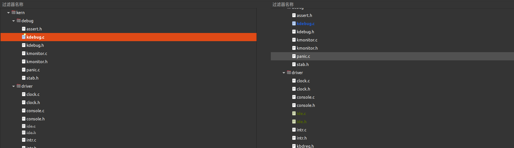
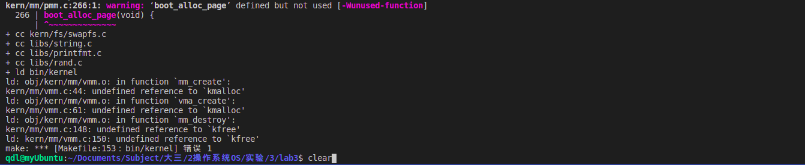
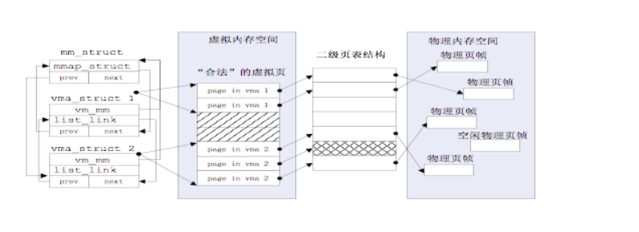
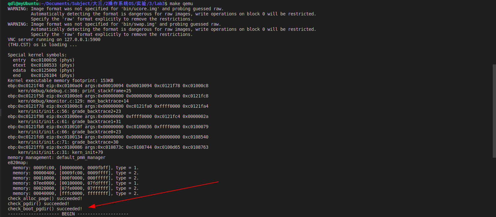
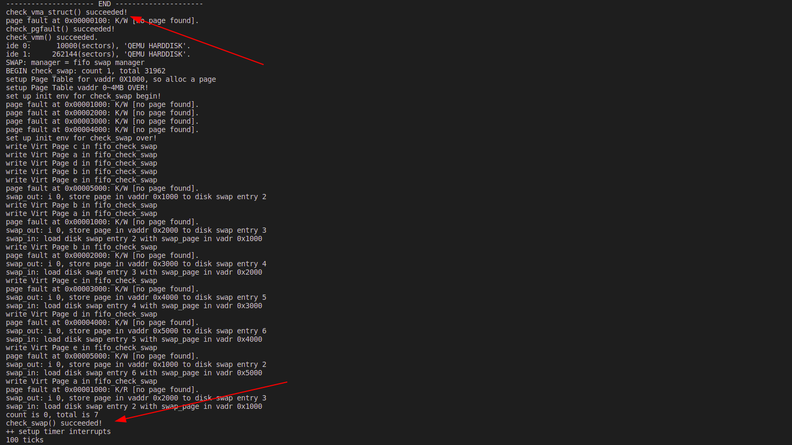
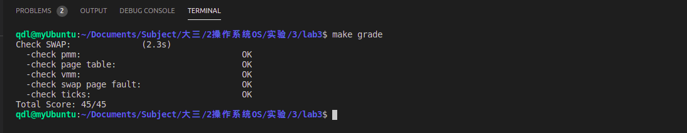

# 实验3 虚拟内存管理


>做完实验二后，大家可以了解并掌握物理内存管理中的连续空间分配算法的具体实现以及如何建立二级页表。本次实验是在实验二的基础上，借助于页表机制和实验一中涉及的中断异常处理机制，完成Page Fault异常处理和FIFO页替换算法的实现。实验原理最大的区别是在设计了如何在磁盘上缓存内存页，从而能够支持虚存管理，**提供一个比实际物理内存空间“更大”的虚拟内存空间给系统使用。**

参考地址:

- 清华Student:　 https://www.jianshu.com/p/8d6ce61ac678?utm_campaign=hugo
- 知识准备:　https://www.cnblogs.com/xiaoxiongcanguan/p/13854711.html
- 知识准备：https://www.cnblogs.com/kangyupl/p/12752885.html
- 啊丁啊:https://blog.csdn.net/dingdingdodo/article/details/100623393


## 实验目的

- 了解虚拟内存的Page Fault异常处理实现
- 了解页替换算法在操作系统中的实现


## 实验内容

本次实验是在实验二的基础上，借助于页表机制和实验一中涉及的中断异常处理机制，完成Page Fault异常处理和FIFO页替换算法的实现，结合磁盘提供的缓存空间，从而能够支持虚存管理，提供一个比实际物理内存空间“更大”的虚拟内存空间给系统使用。这个实验与实际操作系统中的实现比较起来要简单，不过需要了解实验一和实验二的具体实现。实际操作系统系统中的虚拟内存管理设计与实现是相当复杂的，涉及到与进程管理系统、文件系统等的交叉访问。如果大家有余力，可以尝试完成扩展练习，实现extended　clock页替换算法。


## 练习


### 练习0

- 填写已有实验: 本实验依赖实验1/2。请把你做的实验1/2的代码填入本实验中代码中有“LAB1”,“LAB2”的注释相应部分。

- 同样的, 我们使用meld工具:

```bash
$ meld
pmm.c
default_pmm.c
trap.c
```





- 在合并的过程中, 我出现了错误, 后来发现原来是在`pmm.c`中定义了新的函数, 看来meld直接替换还是有些问题



```bash
对于上述的问题, 我们还需要手动合并
```


## 重要数据结构

对于第一个问题的出现，在于实验二中有关内存的数据结构和相关操作都是直接针对实际存在的资源--物理内存空间的管理，没有从一般应用程序对内存的“需求”考虑，即需要有相关的数据结构和操作来体现一般应用程序对虚拟内存的“需求”。一般应用程序的对虚拟内存的“需求”与物理内存空间的“供给”没有直接的对应关系，ucore是通过page fault异常处理来间接完成这二者之间的衔接。


page_fault函数不知道哪些是“合法”的虚拟页，原因是ucore还缺少一定的数据结构来描述这种不在物理内存中的“合法”虚拟页。为此ucore通过建立mm_struct和vma_struct数据结构，描述了ucore模拟应用程序运行所需的合法内存空间。当访问内存产生page fault异常时，可获得访问的内存的方式（读或写）以及具体的虚拟内存地址，这样ucore就可以查询此地址，看是否属于vma_struct数据结构中描述的合法地址范围中，如果在，则可根据具体情况进行请求调页/页换入换出处理（这就是练习2涉及的部分）；如果不在，则报错。mm_struct和vma_struct数据结构结合页表表示虚拟地址空间和物理地址空间的示意图如下所示：



图 虚拟地址空间和物理地址空间的示意图


- vma:描述了一块连续的虚拟内存空间,保证start<=end

```c
Copystruct vma_struct {
    struct mm_struct *vm_mm; // the set of vma using the same PDT 
    uintptr_t vm_start;      // start addr of vma      
    uintptr_t vm_end;        // end addr of vma, not include the vm_end itself
    uint32_t vm_flags;       // flags of vma
    list_entry_t list_link;  // linear list link which sorted by start addr of vma
};
```

- mm:管理使用同一PDT的vma集合的结构体

  mm实现类似于物理内存管理里的free_area,是一个管理虚拟内存的链表,mm为指向头元素的指针,每一项都是vma

```c
Copystruct mm_struct {
    list_entry_t mmap_list;        // linear list link which sorted by start addr of vma,
    								//一直指向头部
    struct vma_struct *mmap_cache; // current accessed vma, used for speed purpose,
   								 //一直指向最后访问项
    pde_t *pgdir;                  // the PDT of these vma
    int map_count;                 // the count of these vma
    void *sm_priv;                 // the private data for swap manager
};
```

- mm_create: 分配一个mm并初始化
  如果此时已初始化SM,则调用SM的init_mm
- mm_destroy: 释放mm管理的内存和它自身
- vma_create: 创建一个vma并初始化
- insert_vma_struct: 把指定vma插入到指定mm里.
  以为要保证插入后起始地址从小到达排,所以遍历mm->mmap_list,找到地址刚好比vma地址大的一项,插到它前面.并检查vma的地址范围与前一项和后一项是否重叠
- find_vma: 在mm里查找包含指定addr的vma
  与插入不同,查找是按着mmap_cache遍历链表来缩短查找的期望时间,并在查找成功后更新mmap_cache为找到的vma


### 练习1

给未被映射的地址映射上物理页（需要编程）

完成`do_pgfault（mm/vmm.c）`函数，给未被映射的地址映射上物理页。设置访问权限 的时候需要参考页面所在 VMA 的权限，同时需要注意映射物理页时需要操作内存控制 结构所指定的页表，而不是内核的页表。注意：在LAB3 EXERCISE 1处填写代码。执行

```bash
make　qemu
```

后，如果通过check_pgfault函数的测试后，会有“check_pgfault() succeeded!”的输出，表示练习1基本正确。

请在实验报告中简要说明你的设计实现过程。请回答如下问题：

- 请描述页目录项（Page Directory Entry）和页表项（Page Table Entry）中组成部分对ucore实现页替换算法的潜在用处。
- 如果ucore的缺页服务例程在执行过程中访问内存，出现了页访问异常，请问硬件要做哪些事情？


#### 为什么使用do_pgfault函数

在lab2中完成了对物理内存的管理以及使能了页机制，而在本次实验中则进一步对内存管理进行了完善，使得ucore支持虚拟内存管理，这使得可能出现某一些虚拟内存空间是合法的（在vma中），但是还没有为其分配具体的内存页，这样的话，在访问这些虚拟页的时候就会产生pagefault异常，从而使得OS可以在异常处理时完成对这些虚拟页的物理页分配，在中端返回之后就可以正常进行内存的访问了。在完成练习之前，不妨首先分析一下在ucore操作系统中，如果出现了page fault，应当进行怎样的处理流程。不妨对ucore的代码分析如下：

- 首先与其他中端的处理相似的，硬件会将程序状态字压入中端栈中，与ucore中的部分中端处理代码一起建立起一个trapframe，并且硬件还会将出现了异常的线性地址保存在cr2寄存器中；
- 与通常的中断处理一样，最终page fault的处理也会来到trap_dispatch函数，在该函数中会根据中断号，将page fault的处理交给pgfault_handler函数，进一步交给do_pgfault函数进行处理，因此do_pgfault函数便是我们最终需要用来对page fault进行处理的地方；
- 对于pageDefalut异常处理, 可以参考: https://chyyuu.gitbooks.io/ucore_os_docs/content/lab3/lab3_4_page_fault_handler.html


####  对do_pgfault函数进行分析

- 函数参数:

  第一个是一个`mm_struct`变量，其中保存了所使用的`PDT`，合法的虚拟地址空间（使用链表组织），以及与后文的swap机制相关的数据；

  第二个参数是产生pagefault的时候硬件产生的`error code`，可以用于帮助判断发生page fault的原因

  最后一个参数则是出现`page fault`的线性地址（保存在cr2寄存器中的线性地址）；

```c
int
do_pgfault(struct mm_struct *mm, uint32_t error_code, uintptr_t addr);
```

- 在函数中，首先查询mm_struct中的合法的虚拟地址(事实上是线性地址，但是由于在ucore中弱化了段机制，段仅仅起到对等映射的作用，因此虚拟地址等于线性地址)链表，用于确定当前出现page fault的线性地址是否合法，如果合法则继续执行调出物理页，否则直接返回；

```c
//返回状态参数
int ret = -E_INVAL;                         
//try to find a vma which include addr
//查询mm_struct中的合法的虚拟地址
struct vma_struct *vma = find_vma(mm, addr);

pgfault_num++;
//If the addr is in the range of a mm's vma?
//如果地址合法执行调出物理页,否则返回失败
if (vma == NULL || vma->vm_start > addr) {
    cprintf("not valid addr %x, and  can not find it in vma\n", addr);
    goto failed;
}
```

- 接下来使用error code, 其指示这次内存访问是否为读/写，对应的物理页是否存在. 

  对查找到的该线性地址的内存页是否允许读写来判断是否出现了读/写不允许读/写的页这种情况

  如果出现了上述情况，则应该直接返回，否则继续执行page fault的处理流程；

  `( W/R=1, P=1):` error code的后2位, 内存访问是否为读/写，对应的物理页是否存在

```c
//check the error_code
//检查pagefault时,硬件产生的error code错误码, 后两位
switch (error_code & 3) {
default:
        /* error code flag : default is 3 ( W/R=1, P=1): write, present */
case 2: /* error code flag : (W/R=1, P=0): write, not present */
//(W/R=1, P=0) 允许写, 不存在, 如果地址不允许写goto failed
    if (!(vma->vm_flags & VM_WRITE)) {
        cprintf("do_pgfault failed: error code flag = write AND not present, but the addr's vma cannot write\n");
        goto failed;
    }
    break;
case 1: /* error code flag : (W/R=0, P=1): read, present */
//(W/R=0, P=1) 允许读, 存在, 直接返回
    cprintf("do_pgfault failed: error code flag = read AND present\n");
    goto failed;
case 0: /* error code flag : (W/R=0, P=0): read, not present */
//(W/R=0, P=0)  允许读, 不存在,  如果地址不允许读或执行,goto fail
if (!(vma->vm_flags & (VM_READ | VM_EXEC))) {
        cprintf("do_pgfault failed: error code flag = read AND not present, but the addr's vma cannot read or exec\n");
        goto failed;
    }
}
```

- 接下来根据合法虚拟地址（mm_struct中保存的合法虚拟地址链表中可查询到）的标志，来生成对应产生的物理页的权限；

```c
uint32_t perm = PTE_U;
if (vma->vm_flags & VM_WRITE) {
    perm |= PTE_W;
}
addr = ROUNDDOWN(addr, PGSIZE);     //四舍五入, 获取addr规范处理后的地址

ret = -E_NO_MEM;                    //由于内存不足，请求失败 
```

- 最后要实现的是练习1的部分, 我单独分成一个标题来讲解


#### 实现思路和代码

- 使用`get_pte`来获取出错的线性地址对应的虚拟页起始地址对应到的页表项,  这个函数我们在实验2中就已经实现了

  其中`get_pte`的参数`pde_t *pgdir`可以由结构, `mm_struct`中保存的合法虚拟地址链表中可查询到

  注意: 在`ucore`中同时使用页表项来保存物理地址（在Present位为1的时候）以及被换出的物理页在swap外存中的位置（以页为单位，每页大小刚好为8个扇区，此时P位为0），并且规定swap中的第0个页空出来不用于交换. 

- 如果需要的物理页是没有分配而不是被换出到外存中, 那么分配物理页, 建立虚拟页的映射关系

  判断ptep=0 说明虚拟地址不存在, 这个时候要分配物理页

  通过`pgdir_alloc_page`函数分配新的物理页,并且建立映射

- 如果查询到的PTE不为0，则表示对应的物理页可能在内存中或者在外存中（根据P位决定）, 这就是练习2 的内容了.


```c
// 获取当前发生缺页的虚拟页对应的PTE
ptep = get_pte(mm->pgdir, addr, 1); 						
// 如果需要的物理页是没有分配而不是被换出到外存中
if (*ptep == 0) { 											
    // 分配物理页，并且与对应的虚拟页建立映射关系
    struct Page* page = pgdir_alloc_page(mm->pgdir, addr, perm); 
    
} else {
    // 将物理页从外存换到内存中，练习2中需要实现的内容
}
```


#### 回答问题


##### (1) 

请描述页目录项（Page Directory Entry）和页表项（Page Table Entry）中组成部分对ucore实现页替换算法的潜在用处。

- 先分析PDE以及PTE中各个组成部分以及其含义；

  页目录项的每个组成部分，PDE（页目录项）的具体组成如下图所示；描述每一个组成部分的含义如下[1]：
   \- 前20位表示4K对齐的该PDE对应的页表起始位置（物理地址，该物理地址的高20位即PDE中的高20位，低12位为0）；
   \- 第9-11位未被CPU使用，可保留给OS使用；
   \- 接下来的第8位可忽略；
   \- 第7位用于设置Page大小，0表示4KB；
   \- 第6位恒为0；
   \- 第5位用于表示该页是否被使用过；
   \- 第4位设置为1则表示不对该页进行缓存；
   \- 第3位设置是否使用write through缓存写策略；
   \- 第2位表示该页的访问需要的特权级；
   \- 第1位表示是否允许读写；
   \- 第0位为该PDE的存在位；


接下来描述页表项（PTE）中的每个组成部分的含义，具体组成如下图所示[2]：

- 高20位与PDE相似的，用于表示该PTE指向的物理页的物理地址；
- 9-11位保留给OS使用；
- 7-8位恒为0；
- 第6位表示该页是否为dirty，即是否需要在swap out的时候写回外存；
- 第5位表示是否被访问；
- 3-4位恒为0；
- 0-2位分别表示存在位、是否允许读写、访问该页需要的特权级；


结论:

- 通过上述分析可以发现，无论是页目录项还是页表项，表项中均保留了3位供操作系统进行使用，可以为实现一些页替换算法的时候提供支持，并且事实上在PTE的Present位为0的时候，CPU将不会使用PTE上的内容，这就使得当P位为0的时候，可以使用PTE上的其他位用于保存操作系统需要的信息，事实上ucore也正是利用这些位来保存页替换算法里被换出的物理页的在交换分区中的位置；

- 此外PTE中还有dirty位，用于表示当前的页是否经过修改，这就使得OS可以使用这个位来判断是否可以省去某些已经在外存中存在着，内存中的数据与外存相一致的物理页面换出到外存这种多余的操作；
- 而PTE和PDE中均有表示是否被使用过的位，这就使得OS可以粗略地得知当前的页面是否具有着较大的被访问概率，使得OS可以利用程序的局部性原理来对也替换算法进行优化(时钟替换算法中使用)；


##### (2) 

如果ucore的缺页服务例程在执行过程中访问内存，出现了页访问异常，请问硬件要做哪些事情？

考虑到ucore的缺页服务例程如果在访问内容中出现了缺页异常，则会有可能导致ucore最终无法完成缺页的处理，因此一般不应该将缺页的ISR以及OS中的其他一些关键代码或者数据换出到外存中，以确保操作系统的正常运行；

如果缺页ISR在执行过程中遇到页访问异常，则最终硬件需要完成的处理与正常出现页访问异常的处理相一致，均为：

- 将发生错误的线性地址保存在cr2寄存器中;
- 在中断栈中依次压入EFLAGS，CS, EIP，以及页访问异常码error code，由于ISR一定是运行在内核态下的，因此不需要压入ss和esp以及进行栈的切换；
- 根据中断描述符表查询到对应页访问异常的ISR，跳转到对应的ISR处执行，接下来将由软件进行处理；


#### 测试结果

```bash
$ make qemu
```




### 练习2

- 补充完成基于FIFO的页面替换算法（需要编程）

- 完成`vmm.c`中的do_pgfault函数，并且在实现FIFO算法的`swap_fifo.c`中完成map_swappable和swap_out_victim函数。通过对swap的测试。注意：在LAB3 EXERCISE 2处填写代码。执行

```bash
$ make　qemu
```

后，如果通过check_swap函数的测试后，会有“check_swap() succeeded!”的输出，表示练习2基本正确。

请在实验报告中简要说明你的设计实现过程。请在实验报告中回答如下问题：

- 如果要在ucore上实现"extended clock页替换算法"请给你的设计方案，现有的swap_manager框架是否足以支持在ucore中实现此算法？如果是，请给你的设计方案。如果不是，请给出你的新的扩展和基此扩展的设计方案。并需要回答如下问题
  - 需要被换出的页的特征是什么？
  - 在ucore中如何判断具有这样特征的页？
  - 何时进行换入和换出操作？


#### 如何确定物理页的位置?

承接练习1的else分支,  如果查询到的PTE不为0，则表示对应的物理页可能在内存中或者在外存中，则需要将其换入内存，之后中断返回之后便可以进行正常的访问处理。参考`UCORE`的资料我们发现, 在换入的时候, 我们要思考两个问题:

- 应当在何处获取物理页在外存中的位置？
  - 物理页在外存中的位置保存在了PTE中；
- 如果当前没有了空闲的内存页，应当将哪一个物理页换出到外存中去？
  - 对于不同的算法会有不同的实现，在本练习中所实现的FIFO算法则选择将在内存中驻留时间最长的物理页换出；

- 参考地址 : https://chyyuu.gitbooks.io/ucore_os_docs/content/lab3/lab3_5_2_page_swapping_principles.html


#### (1) do_pgfault 实现换入

如果查询到的PTE不为0，则表示对应的物理页可能在内存中或者在外存中，则需要将其换入内存，之后中断返回之后便可以进行正常的访问处理

- 判断当前是否对交换机制进行了正确的初始化；

  通过全局变量`swap_init_ok`来判断,  为true表示进行了正确的初始化

```c
if(swap_init_ok) {}
```

- 将虚拟页对应的物理页从外存中换入内存

  在`swap.c` 中定义了函数`swap_in`, 它可以完成物理页换入的操作

  如果返回值不为0 说明换入失败, 我们需要转入必要的failed处理程序

```c
if ((ret = swap_in(mm, addr, &page)) != 0) {
    cprintf("swap_in in do_pgfault failed\n");
    goto failed;
}    
```

- 给换入的物理页和虚拟页建立映射关系；

  在`pmm.c`中, 实现了函数`page_insert`, 它用来对线性地址la建立一个页面的phy地址映射, 下面我会对他的参数做一个快速的介绍:

```c
page_insert(pde_t *pgdir, struct Page *page, uintptr_t la, uint32_t perm);
// pgdir: PDT的内核虚拟基地址
// page:需要映射的页面
// la:需要映射的线性地址
// perm:在相关pte中设置的本页权限
```

我们要做的是调用page_insert将phy addr映射为逻辑addr

```c
page_insert(mm->pgdir, page, addr, perm);
// 其中本页的权限设置为了User
// 在mm.h中进行了定义
```

- 将换入的物理页设置为允许被换出

  在`swap.c`中定义了函数`swap_map_swappable`, 他用来将add地址设置为允许被换出

```c
swap_map_swappable(mm, addr, page, 1);
page->pra_vaddr = addr;
```

- 最后将当前页的`pra`设置为逻辑地址, 这个地址在替换算法中将会被用到

```c
uintptr_t pra_vaddr;            // used for pra (page replace algorithm) 替换算法将会用到
```

- 如果当前没有对交换机制进行正确的初始化, 转向fail

```c
else {
    cprintf("no swap_init_ok but ptep is %x, failed\n",*ptep);
    goto failed;
}
```


#### (2)  map_swappable

在page fault处理中我们使用了一个与交换相关的函数`swap_map_swappable`

- 函数功能: 将当前的物理页面插入到FIFO算法中维护的可被交换出去的物理页面链表中的末尾，从而保证该链表中越接近链表头的物理页面在内存中的驻留时间越长
- 我们使用list_add(head, entry)将最新到达的页面链接到链表pra_list_head qeueue最后

```c
static int
_fifo_map_swappable(struct mm_struct *mm, uintptr_t addr, struct Page *page, int swap_in)
{
    list_entry_t *head=(list_entry_t*) mm->sm_priv;
    list_entry_t *entry=&(page->pra_page_link);
    assert(entry != NULL && head != NULL);
    
    //list_add(head, entry)将最新到达的页面链接到链表pra_list_head qeueue最后
    list_add(head, entry);
    return 0;
}
```


#### (3) swap_out_victim函数

当调用swap_in函数的时候，会继续调用alloc_page函数分配物理页，一旦没有足够的物理页，则会使用swap_out函数将当前物理空间的某一页换出到外存，该函数会进一步调用sm（swap manager）中封装的swap_out_victim函数来选择需要换出的物理页，该函数是一个函数指针进行调用的，具体对应到了`_fifo_swap_out_victim`函数

- 函数功能 : `_fifo_swap_out_victim`函数用FIFO先进先出的顺序替换地一个牺牲页
- 实现方法: 在FIFO算法中，按照物理页面换入到内存中的顺序建立了一个链表，链表头处便指向了最早进入的物理页面，也就在在本算法中需要被换出的页面，因此只需要将链表头的物理页面取出，然后删掉对应的链表项,
- 具体的代码实现如下所示：

```c
static int
_fifo_swap_out_victim(struct mm_struct *mm, struct Page ** ptr_page, int in_tick)
{
     list_entry_t *head=(list_entry_t*) mm->sm_priv;            // 找到链表的入口
         assert(head != NULL);
     assert(in_tick==0);
     list_entry_t *le = head->prev;                             // 取出链表头，即最早进入的物理页面
     assert(head!=le);                                          
     struct Page *p = le2page(le, pra_page_link);               // 找到对应的物理页面的Page结构
     list_del(le);                                              // 删除牺牲页
     assert(p !=NULL);                                          
     *ptr_page = p;                                             // 从链表上删除取出的即将被换出的物理页面
     return 0;
}
```


### 回答问题

如果要在ucore上实现"extended clock页替换算法"请给你的设计方案，现有的swap_manager框架是否足以支持在ucore中实现此算法？如果是，请给你的设计方案。如果不是，请给出你的新的扩展和基此扩展的设计方案。并需要回答如下问题

- 需要被换出的页的特征是什么？
- 在ucore中如何判断具有这样特征的页？
- 何时进行换入和换出操作？


#### 设计方案

在现有框架基础上可以支持Extended clock算法，但是要进行物理也描述信息的扩展. 

下面是我的设计方案：(我参考了一篇博客https://www.jianshu.com/p/8d6ce61ac678?utm_campaign=hugo)

当需要调入一页必须淘汰一个旧页时，淘汰最近的时间段没有访问的页面。可以认为是FIFO与LRU的一种折中方案，考虑之前的访问情况，但不是考虑之前所有的访问情况。通过对过去一段时间页面的访问情况进行统计即可，为了实现该算法，通常在页表项中增加访问位，当装入内存时，访问位初始化为0，访问页面时访问位置为1；且各页面组织成环形链表，指针总是指向最先调入的页。访问页面时，在页表项记录页面访问情况；缺页时，从指针处开始顺序查找未被访问的页面进行置换，访问位为0的话置换该页，如果为1向下继续找。例子：


- 根据上文中提及到的PTE的组成部分可知，PTE中包含了dirty位和访问位，因此可以确定某一个虚拟页是否被访问过以及写过.

  但是，考虑到在替换算法的时候是将物理页面进行换出，而可能存在着多个虚拟页面映射到同一个物理页面这种情况，也就是说某一个物理页面是否dirty和是否被访问过是有这些所有的虚拟页面共同决定的.

  而在原先的实验框架中，物理页的描述信息Page结构中默认只包括了一个对应的虚拟页的地址，应当采用链表的方式，在Page中扩充一个成员，把物理页对应的所有虚拟页都给保存下来；而物理页的dirty位和访问位均为只需要某一个对应的虚拟页对应位被置成1即可置成1；

  

- 完成了上述对物理页描述信息的拓展之后，对FIFO算法的框架进行修改得到拓展时钟算法的框架，这两种算法都是将所有可以换出的物理页面均按照进入内存的顺序连成一个环形链表.

  

- 将某个页面置为可以/不可以换出这些函数均不需要进行大的修改(小的修改包括在初始化当前指针等)，唯一需要进行重写的函数是选择换出物理页的函数swap_out_victim，对该函数的修改伪代码如下：

  从当前指针开始，对环形链表进行扫描，根据指针指向的物理页的状态（表示为(access, dirty)）来确定应当进行何种修改：

  - 如果状态是(0, 0)，则将该物理页面从链表上去下，该物理页面记为换出页面，但是由于这个时候这个页面不是dirty的，因此事实上不需要将其写入swap分区；
  - 如果状态是(0, 1)，则将该物理页对应的虚拟页的PTE中的dirty位都改成0，并且将该物理页写入到外存中，然后指针跳转到下一个物理页；
  - 如果状态是(1, 0), 将该物理页对应的虚拟页的PTE中的访问位都置成0，然后指针跳转到下一个物理页面；
  - 如果状态是(1, 1)，则该物理页的所有对应虚拟页的PTE中的访问为置成0，然后指针跳转到下一个物理页面；


下面的练习解答都在Ucore网站上有资料, 我参考并且总结回答了练习中的问题:

https://chyyuu.gitbooks.io/ucore_os_docs/content/lab3/lab3_5_2_page_swapping_principles.html

#### (1)

需要被换出的页的特征是什么？

并非所有的物理页都可以交换出去的，只有映射到用户空间且被用户程序直接访问的页面才能被交换，而被内核直接使用的内核空间的页面不能被换出。

原因: 操作系统是执行的关键代码，需要保证运行的高效性和实时性，如果在操作系统执行过程中，发生了缺页现象，则操作系统不得不等很长时间（硬盘的访问速度比内存的访问速度慢2~3个数量级），这将导致整个系统运行低效。而且，不难想象，处理缺页过程所用到的内核代码或者数据如果被换出，整个内核都面临崩溃的危险。


- 该物理页在当前指针上一次扫过之前没有被访问过；
- 该物理页的内容与其在外存中保存的数据是一致的, 即没有被修改过;


#### (2)

在ucore中如何判断具有这样特征的页?

- 假如某物理页对应的所有虚拟页中存在一个dirty的页，则认为这个物理页为dirty，否则不是；
- 假如某物理页对应的所有虚拟页中存在一个被访问过的页，则认为这个物理页为被访问过的，否则不是；


#### (3)

何时进行换入和换出操作？

- 换入:

  在实验三中， check_mm_struct变量这个数据结构表示了目前 ucore认为合法的所有虚拟内存空间集合，而mm中的每个vma表示了一段地址连续的合法虚拟空间。当ucore或应用程序访问地址所在的页不在内存时，就会产生page fault异常，引起调用do_pgfault函数，此函数会判断产生访问异常的地址属于check_mm_struct某个vma表示的合法虚拟地址空间，且保存在硬盘swap文件中（即对应的PTE的高24位不为0，而最低位为0），则是执行页换入的时机，将调用swap_in函数完成页面换入。

- 换出:

  换出页面的时机相对复杂一些，针对不同的策略有不同的时机。ucore目前大致有两种策略，即积极换出策略和消极换出策略。

  积极换出策略是指操作系统周期性地（或在系统不忙的时候）主动把某些认为“不常用”的页换出到硬盘上，从而确保系统中总有一定数量的空闲页存在，这样当需要空闲页时，基本上能够及时满足需求；

  消极换出策略是指，只是当试图得到空闲页时，发现当前没有空闲的物理页可供分配，这时才开始查找“不常用”页面，并把一个或多个这样的页换出到硬盘上。

### 实验结果

- 执行`make qemu`

```bash
$ make qemu
```



- 执行 `make grade`

```bash
$ make grade
```

  

### Challenge 1

实现识别dirty bit的 extended clock页替换算法（需要编程）

##### 时钟置换算法

当需要调入一页必须淘汰一个旧页时，淘汰最近的时间段没有访问的页面。可以认为是**FIFO与LRU的一种折中方案**，考虑之前的访问情况，但不是考虑之前所有的访问情况。通过对过去一段时间页面的访问情况进行统计即可，为了实现该算法，通常在页表项中增加访问位，当装入内存时，访问位初始化为0，访问页面时访问位置为1；且各页面组织成环形链表，指针总是指向最先调入的页。访问页面时，在页表项记录页面访问情况；缺页时，从指针处开始顺序查找未被访问的页面进行置换，访问位为0的话置换该页，如果为1向下继续找。例子：

　

- 问题分析：

  算法根据页面近期是否被修改从而决定该页面是否应当被换出。所以在查询空闲页时，需要加上对 dirty bit 的判断。

- 实现思路：

  当操作系统需要淘汰页时，对当前指针指向的页所对应的页表项进行查询，如果 dirty bit 为 0 ，则把此页换出到硬盘上；如果 dirty bit 为 1 ，则将 dirty bit 置为 0 ，继续访问下一个页。

#### 实现过程：

- 相比较 FIFO 的操作， dirty bit 的替换算法只需要识别出哪些页被访问过，以及哪些页被修改过即可。在 kern/mm/mmu.h 文件下有如下的定义：

```c
#define PTE_A 0x020 // Accessed
#define PTE_D 0x040 // Dirty
```

- 其中 PTE_A 和 PTE_D 分别是表示访问和修改的标识位，因此与 *ptep 求与即可判断页是否被访问或修改过。首先根据基础的 extended clock 算法，未被访问的页应优先考虑换出；在此基础上，由于被修改的也需要被写会硬盘，因此未被修改的页应该有限换出。因此采用多轮循环。只需要修改 kern/mm/vmm.h 中的 _fifo_swap_out_victim() 函数即可实现

```c
// 如果这行到这里证明找完一圈，所有页面都不符合换出条件
// 那么强行换出最先进入的页面
le = le->next;
while(le != head) {
    struct Page *p = le2page(le, pra_page_link);
    pte_t *ptep = get_pte(mm->pgdir, p->pra_vaddr, 0);    
    if(*ptep & PTE_D) {                                 // 已被修改
        list_del(le);
        assert(p != NULL);
        //将这一页的地址存储在 ptr_page 中
        *ptr_page = p;
        return 0;
    }
    le = le->next;
}
```


```c
_fifo_swap_out_victim(struct mm_struct *mm, struct Page ** ptr_page, int in_tick)
{
    list_entry_t *head = (list_entry_t*) mm->sm_priv;
    assert(head != NULL);
    assert(in_tick == 0);
    // 将 head 指针指向最先进入的页面
    list_entry_t *le = head->next;
    assert(head != le);
    // 查找最先进入并且未被修改的页面
    while(le != head) {
        struct Page *p = le2page(le, pra_page_link);
        // 获取页表项
        pte_t *ptep = get_pte(mm->pgdir, p->pra_vaddr, 0);  
        
        // 判断获得的页表项是否正确  
        if(!(*ptep & PTE_A) && !(*ptep & PTE_D)) {      // 未被访问，未被修改
        // 如果 dirty bit 为 0 ，换出
        // 将页面从队列中删除
        list_del(le);
        
        assert(p != NULL);
        // 将这一页的地址存储在 prt_page 中
            *ptr_page = p;
            return 0;
        }
        le = le->next;
    }
    le = le->next;
    while(le != head) {
        struct Page *p = le2page(le, pra_page_link);
        pte_t *ptep = get_pte(mm->pgdir, p->pra_vaddr, 0);    
        if(!(*ptep & PTE_A) && (*ptep & PTE_D)) {       // 未被访问，已被修改
            list_del(le);
            assert(p != NULL);
            *ptr_page = p;
            return 0;
        }
        *ptep ^= PTE_A;                                 // 页被访问过则将 PTE_A 位置 0
        le = le->next;
    }
    le = le->next;
    while(le != head) {
    struct Page *p = le2page(le, pra_page_link);
    pte_t *ptep = get_pte(mm->pgdir, p->pra_vaddr, 0);    
    if(!(*ptep & PTE_D)) {                              // 未被修改，此时所有页均被访问过，即 PTE_A 位为 0
        list_del(le);
        assert(p != NULL);
        *ptr_page = p;
        return 0;
    }
    le = le->next;
    }
    // 如果这行到这里证明找完一圈，所有页面都不符合换出条件
    // 那么强行换出最先进入的页面
    le = le->next;
    while(le != head) {
        struct Page *p = le2page(le, pra_page_link);
        pte_t *ptep = get_pte(mm->pgdir, p->pra_vaddr, 0);    
        if(*ptep & PTE_D) {                                 // 已被修改
            list_del(le);
            assert(p != NULL);
            //将这一页的地址存储在 ptr_page 中
            *ptr_page = p;
            return 0;
        }
        le = le->next;
    }
}
```


### Challenge 2

- 实现不考虑实现开销和效率的LRU页替换算法（需要编程）


## 项目组成：


- kern/mm/default_pmm.[ch]：

  实现基于struct pmm_manager类框架的Fist-Fit物理内存分配参考实现（分配最小单位为页，即4096字节），相关分配页和释放页等实现会间接被kmalloc/kfree等函数使用。

- kern/mm/pmm.[ch]：

  pmm.h定义物理内存分配类框架struct pmm_manager。pmm.c包含了对此物理内存分配类框架的访问，以及与建立、修改、访问页表相关的各种函数实现。在本实验中会用到kmalloc/kfree等函数。

- libs/list.h：

  定义了通用双向链表结构以及相关的查找、插入等基本操作，这是建立基于链表方法的物理内存管理（以及其他内核功能）的基础。在lab0文档中有相关描述。其他有类似双向链表需求的内核功能模块可直接使用list.h中定义的函数。在本实验中会多次用到插入，删除等操作函数。

- kern/driver/ide.[ch]：

  定义和实现了内存页swap机制所需的磁盘扇区的读写操作支持；在本实验中会涉及通过swapfs_*函数间接使用文件中的函数。故了解即可。

- kern/fs/*：

  定义和实现了内存页swap机制所需从磁盘读数据到内存页和写内存数据到磁盘上去的函数 swapfs_read/swapfs_write。在本实验中会涉及使用这两个函数。

- kern/mm/memlayout.h：

  修改了struct Page，增加了两项pra_*成员结构，其中pra_page_link可以用来建立描述各个页访问情况（比如根据访问先后）的链表。在本实验中会涉及使用这两个成员结构，以及le2page等宏。

- kern/mm/vmm.[ch]：

  vmm.h描述了mm_struct，vma_struct等表述可访问的虚存地址访问的一些信息，下面会进一步详细讲解。vmm.c涉及mm,vma结构数据的创建/销毁/查找/插入等函数，这些函数在check_vma、check_vmm等中被使用，理解即可。而page fault处理相关的do_pgfault函数是本次实验需要涉及完成的。

- kern/mm/swap.[ch]：

  定义了实现页替换算法类框架struct swap_manager。swap.c包含了对此页替换算法类框架的初始化、页换入/换出等各种函数实现。重点是要理解何时调用swap_out和swap_in函数。和如何在此框架下连接具体的页替换算法实现。check_swap函数以及被此函数调用的_fifo_check_swap函数完成了对本次实验中的练习2：FIFO页替换算法基本正确性的检查，可了解，便于知道为何产生错误。

- kern/mm/swap_fifo.[ch]：

  FIFO页替换算法的基于页替换算法类框架struct swap_manager的简化实现，主要被swap.c的相关函数调用。重点是_fifo_map_swappable函数（可用于建立页访问属性和关系，比如访问时间的先后顺序）和_fifo_swap_out_victim函数（可用于实现挑选出要换出的页），当然换出哪个页需要借助于fifo_map_swappable函数建立的某种属性关系，已选出合适的页。

- kern/mm/mmu.h：

  其中定义了页表项的各种属性位，比如PTE_P\PET_D\PET_A等，对于实现扩展实验的clock算法会有帮助。

本次实验的主要练习集中在vmm.c中的do_pgfault函数和swap_fifo.c中的_fifo_map_swappable函数、_fifo_swap_out_victim函数。

