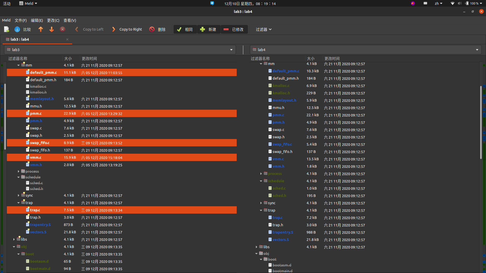
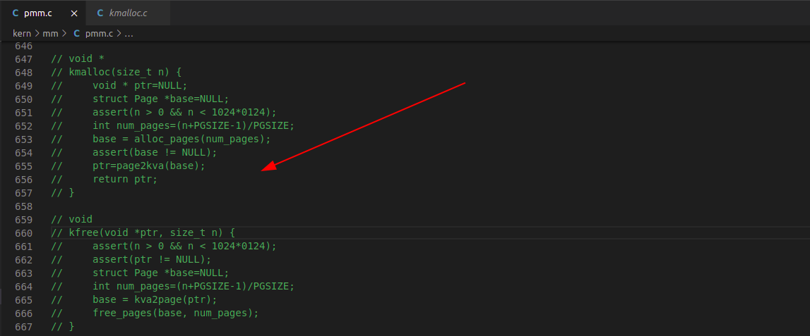
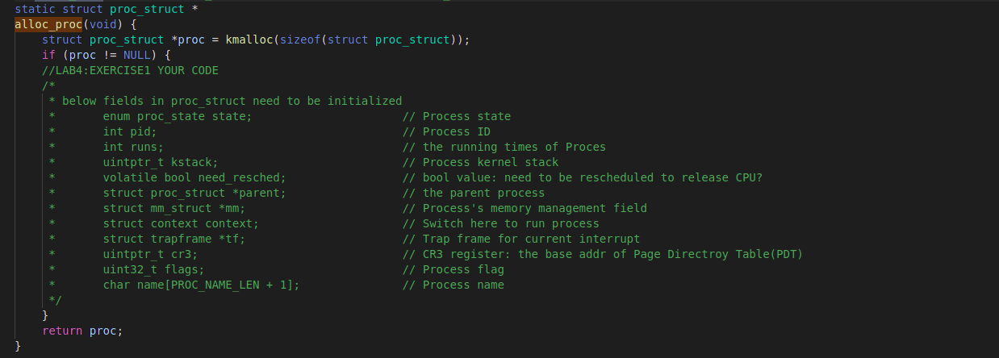
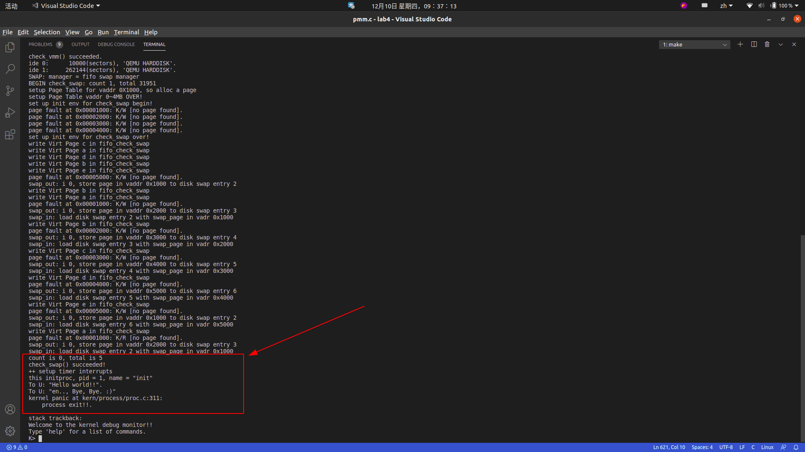

## 实验4 内核线程管理


## 实验目的

- 了解内核线程创建/执行的管理过程
- 了解内核线程的切换和基本调度过程

- https://github.com/AngelKitty/review_the_national_post-graduate_entrance_examination/blob/master/books_and_notes/professional_courses/operating_system/sources/ucore_os_lab/docs/lab_report/lab4/lab4%20%E5%AE%9E%E9%AA%8C%E6%8A%A5%E5%91%8A.md


## 实验内容

实验2/3完成了物理和虚拟内存管理，这给创建内核线程（内核线程是一种特殊的进程）打下了提供内存管理的基础。当一个程序加载到内存中运行时，首先通过ucore OS的内存管理子系统分配合适的空间，然后就需要考虑如何分时使用CPU来“并发”执行多个程序，让每个运行的程序（这里用线程或进程表示）“感到”它们各自拥有“自己”的CPU。

本次实验将首先接触的是内核线程的管理。内核线程是一种特殊的进程，内核线程与用户进程的区别有两个：

- 内核线程只运行在内核态
- 用户进程会在在用户态和内核态交替运行
- 所有内核线程共用ucore内核内存空间，不需为每个内核线程维护单独的内存空间
- 而用户进程需要维护各自的用户内存空间

相关原理介绍可看附录B：【原理】进程/线程的属性与特征解析。

## 练习

对实验报告的要求：

- 基于markdown格式来完成，以文本方式为主
- 填写各个基本练习中要求完成的报告内容
- 完成实验后，请分析ucore_lab中提供的参考答案，并请在实验报告中说明你的实现与参考答案的区别
- 列出你认为本实验中重要的知识点，以及与对应的OS原理中的知识点，并简要说明你对二者的含义，关系，差异等方面的理解（也可能出现实验中的知识点没有对应的原理知识点）
- 列出你认为OS原理中很重要，但在实验中没有对应上的知识点


## 练习0：

填写已有实验

本实验依赖实验1/2/3。请把你做的实验1/2/3的代码填入本实验中代码中有“LAB1”,“LAB2”,“LAB3”的注释相应部分。

`lab4` 会依赖 `lab1、lab2` 和 `lab3`，我们需要把做的 `lab1、lab2` 和 `lab3` 的代码填到 `lab4` 中缺失的位置上面。练习 0 就是一个工具的利用。这里我使用的是 `Linux` 下的系统已预装好的 `Meld Diff Viewer` 工具。和 `lab3` 操作流程一样，我们只需要将已经完成的 `lab1、lab2` 和 `lab3` 与待完成的 `lab4` (由于 `lab4` 是基于 `lab1、lab2、lab3` 基础上完成的，所以这里只需要导入 `lab3` )分别导入进来，然后点击 `compare` 就行了。



然后软件就会自动分析两份代码的不同，然后就一个个比较比较复制过去就行了，在软件里面是可以支持打开对比复制了，点击 `Copy Right` 即可。当然 `bin` 目录和 `obj` 目录下都是 `make` 生成的，就不用复制了，其他需要修改的地方主要有以下五个文件，通过对比复制完成即可：

```
default_pmm.c
pmm.c
swap_fifo.c
vmm.c
trap.c
```



除此之外, 还要将pmm.c定义的函数`kmalloc`,`kfree`注释掉, 因为他们在`kmalloc.c`中被定义


## 练习1：

分配并初始化一个进程控制块（需要编码）

alloc_proc函数（位于kern/process/proc.c中）负责分配并返回一个新的struct proc_struct结构，用于存储新建立的内核线程的管理信息。ucore需要对这个结构进行最基本的初始化，你需要完成这个初始化过程。

> 【提示】在alloc_proc函数的实现中，需要初始化的proc_struct结构中的成员变量至少包括：state/pid/runs/kstack/need_resched/parent/mm/context/tf/cr3/flags/name。

请在实验报告中简要说明你的设计实现过程。请回答如下问题：

- 请说明proc_struct中`struct context context`和`struct trapframe *tf`成员变量含义和在本实验中的作用是啥？（提示通过看代码和编程调试可以判断出来）


### (1) 内核线程与用户进程的区别

内核线程是一种特殊的进程，内核线程与用户进程的区别有两个：

- 内核线程只运行在内核态，而用户进程会在在用户态和内核态交替运行；
- 所有内核线程直接使用共同 `ucore` 内核内存空间，不需为每个内核线程维护单独的内存空间，而用户进程需要维护各自的用户内存空间。


### (2) 总结一下函数清单

从实验1做到实验4, 对很多函数进行了修改, 每个文件有什么功能? 发挥什么作用? 这里从 `kern_init` 函数的物理内存管理初始化开始的，按照函数的次序做了一个简单的总结：

1、pmm_init()

- (1) 初始化物理内存管理器。
- (2) 初始化空闲页，主要是初始化物理页的 Page 数据结构，以及建立页目录表和页表。
- (3) 初始化 boot_cr3 使之指向了 ucore 内核虚拟空间的页目录表首地址，即一级页表的起始物理地址。
- (4) 初始化第一个页表 boot_pgdir。
- (5) 初始化 GDT，即全局描述符表。


2、pic_init()

- 初始化 8259A 中断控制器


3、idt_init()

- 初始化 IDT，即中断描述符表


4、vmm_init()

- 主要就是实验了一个 do_pgfault() 函数达到页错误异常处理功能，以及虚拟内存相关的 mm,vma 结构数据的创建/销毁/查找/插入等函数


5、proc_init()

- 这个函数启动了创建内核线程的步骤，完成了 idleproc 内核线程和 initproc 内核线程的创建或复制工作，这是本次实验分析的重点，后面将详细分析。


6、ide_init()

- 完成对用于页换入换出的硬盘(简称 swap 硬盘)的初始化工作


7、swap_init()

- swap_init() 函数首先建立完成页面替换过程的主要功能模块，即 swap_manager，其中包含了页面置换算法的实现

操作系统是以进程为中心设计的，所以其首要任务是为进程建立档案，进程档案用于表示、标识或描述进程，即进程控制块。这里需要完成的就是一个进程控制块的初始化。


### (3) 重要数据结构PCB

这里我们分配的是一个内核线程的 PCB，它通常只是内核中的一小段代码或者函数，没有用户空间。而由于在操作系统启动后，已经对整个核心内存空间进行了管理，通过设置页表建立了核心虚拟空间(即 boot_cr3 指向的二级页表描述的空间)。所以内核中的所有线程都不需要再建立各自的页表，只需共享这个核心虚拟空间就可以访问整个物理内存了。

首先在 `kern/process/proc.h` 中定义了 `PCB`，即进程控制块的结构体 `proc_struct`，如下：

```c
struct proc_struct {             //进程控制块
    enum proc_state state;       //进程状态
    int pid;                     //进程ID
    int runs;                    //运行时间
    uintptr_t kstack;            //内核栈位置
    volatile bool need_resched;  //是否需要调度
    struct proc_struct *parent;  //父进程
    struct mm_struct *mm;        //进程的虚拟内存
    struct context context;      //进程上下文
    struct trapframe *tf;        //当前中断帧的指针
    uintptr_t cr3;               //当前页表地址
    uint32_t flags;              //进程
    char name[PROC_NAME_LEN + 1];//进程名字
    list_entry_t list_link;      //进程链表       
    list_entry_t hash_link;      //进程哈希表            
};
```

参数信息如下:

这里简单介绍下各个参数：

1. state：进程所处的状态。

   PROC_UNINIT // 未初始状态

   PROC_SLEEPING // 睡眠（阻塞）状态

   PROC_RUNNABLE // 运行与就绪态

   PROC_ZOMBIE // 僵死状态

2. pid：进程 id 号。

3. kstack：记录了分配给该进程/线程的内核桟的位置。

4. need_resched：是否需要调度

5. parent：用户进程的父进程。

6. mm：即实验三中的描述进程虚拟内存的结构体

7. context：进程的上下文，用于进程切换。

8. tf：中断帧的指针，总是指向内核栈的某个位置。中断帧记录了进程在被中断前的状态。

9. cr3：记录了当前使用的页表的地址

```c
proc->state = PROC_UNINIT;
proc->pid = -1;
proc->cr3 = boot_cr3; // 由于是内核线程，共用一个虚拟内存空间
```


### (3)  补充函数alloc_proc 分配并初始化进程控制块

- alloc_proc函数（位于kern/process/proc.c中）负责分配并返回一个新的struct proc_struct结构，用于存储新建立的内核线程的管理信息。ucore需要对这个结构进行最基本的初始化，你需要完成这个初始化过程。

- 实现思路:



该函数的具体含义为创建一个新的进程控制块，并且对控制块中的所有成员变量进行初始化，根据实验指导书中的要求，除了指定的若干个成员变量之外，其他成员变量均初始化为0，取特殊值的成员变量如下所示：

```
proc->state = PROC_UNINIT;
proc->pid = -1;
proc->cr3 = boot_cr3; // 由于是内核线程，共用一个虚拟内存空间
```

- 对于其他成员变量中占用内存空间较大的，可以考虑使用 memset 函数进行初始化。


```c
static struct proc_struct *alloc_proc(void) {
    struct proc_struct *proc = kmalloc(sizeof(struct proc_struct));
    if (proc != NULL) {
        proc->state = PROC_UNINIT;  //设置进程为未初始化状态
        proc->pid = -1;             //未初始化的的进程id为-1
        proc->runs = 0;             //初始化时间片
        proc->kstack = 0;           //内存栈的地址
        proc->need_resched = 0;     //是否需要调度设为不需要
        proc->parent = NULL;        //父节点设为空
        proc->mm = NULL;            //虚拟内存设为空
        memset(&(proc->context), 0, sizeof(struct context));//上下文的初始化
        proc->tf = NULL;            //中断帧指针置为空
        proc->cr3 = boot_cr3;       //页目录设为内核页目录表的基址
        proc->flags = 0;            //标志位
        memset(proc->name, 0, PROC_NAME_LEN);//进程名
    }
    return proc;
}
```


### (4) 回答问题

请说明 proc_struct 中 `struct context context` 和 `struct trapframe *tf` 成员变量含义和在本实验中的作用是啥？

- context是进程上下文，即进程执行时各寄存器的取值。用于进程切换时保存进程上下文比如本实验中，当idle进程被CPU切换出去时，可以将idle进程上下文保存在其proc_struct结构体的context成员中，这样当CPU运行完init进程，再次运行idle进程时，能够恢复现场，继续执行。

```c
struct context {
    uint32_t eip;
    uint32_t esp;
    uint32_t ebx;
    uint32_t ecx;
    uint32_t edx;
    uint32_t esi;
    uint32_t edi;
    uint32_t ebp;
};
```

- tf是中断帧，具体定义如下。

```c
struct trapframe {
    struct pushregs tf_regs;
    uint16_t tf_gs;
    uint16_t tf_padding0;
    uint16_t tf_fs;
    uint16_t tf_padding1;
    uint16_t tf_es;
    uint16_t tf_padding2;
    uint16_t tf_ds;
    uint16_t tf_padding3;
    uint32_t tf_trapno;
    /* below here defined by x86 hardware */
    uint32_t tf_err;
    uintptr_t tf_eip;
    uint16_t tf_cs;
    uint16_t tf_padding4;
    uint32_t tf_eflags;
    /* below here only when crossing rings, such as from user to kernel */
    uintptr_t tf_esp;
    uint16_t tf_ss;
    uint16_t tf_padding5;
} __attribute__((packed));
```

1. **trap_frame与context的区别是什么？**
   - 从内容上看，trap_frame包含了context的信息，除此之外，trap_frame还保存有段寄存器、中断号、错误码err和状态寄存器eflags等信息。
   - 从作用时机来看，context主要用于进程切换时保存进程上下文，trap_frame主要用于发生中断或异常时保存进程状态。
   - 当进程进行系统调用或发生中断时，会发生特权级转换，这时也会切换栈，因此需要保存栈信息（包括ss和esp）到trap_frame，但不需要更新context。
2. **trap_frame与context在创建进程时所起的作用：**
   - 当创建一个新进程时，我们先分配一个进程控制块proc，并设置好其中的tf及context变量；
   - 然后，当调度器schedule调度到该进程时，首先进行上下文切换，这里关键的两个上下文信息是context.eip和context.esp，前者提供新进程的起始入口，后者保存新进程的trap_frame地址。
   - 上下文切换完毕后，CPU会跳转到新进程的起始入口。在新进程的起始入口中，根据trap_frame信息设置通用寄存器和段寄存器的值，并执行真正的处理函数。可见，tf与context共同用于进程的状态保存与恢复。
   - 综上，由上下文切换到执行新进程的处理函数fn，中间经历了多次函数调用：forkret() -> forkrets(current->tf) -> __trapret -> kernel_thread_entry -> init_main.

根据这张图可以看出，内核态和用户态的转换首先是留下 SS 和 ESP 的位置，然后调用中断，改中断栈里面的内容， 然后退出中断的时候跳到内核态中，最后将 ebp 赋给 esp 修复 esp 的位置。


## 练习2：

为新创建的内核线程分配资源（需要编码）

创建一个内核线程需要分配和设置好很多资源。kernel_thread函数通过调用**do_fork**函数完成具体内核线程的创建工作。do_kernel函数会调用alloc_proc函数来分配并初始化一个进程控制块，但alloc_proc只是找到了一小块内存用以记录进程的必要信息，并没有实际分配这些资源。ucore一般通过do_fork实际创建新的内核线程。do_fork的作用是，创建当前内核线程的一个副本，它们的执行上下文、代码、数据都一样，但是存储位置不同。在这个过程中，需要给新内核线程分配资源，并且复制原进程的状态。你需要完成在kern/process/proc.c中的do_fork函数中的处理过程。它的大致执行步骤包括：

- 调用alloc_proc，首先获得一块用户信息块。
- 为进程分配一个内核栈。
- 复制原进程的内存管理信息到新进程（但内核线程不必做此事）
- 复制原进程上下文到新进程
- 将新进程添加到进程列表
- 唤醒新进程
- 返回新进程号

请在实验报告中简要说明你的设计实现过程。请回答如下问题：

- 请说明ucore是否做到给每个新fork的线程一个唯一的id？请说明你的分析和理由。


### (1) 实现函数 do_fork 完成内核线程的创建工作

- 实现思路:

该函数的语义为为内核线程创建新的线程控制块，并且对控制块中的每个成员变量进行正确的设置，使得之后可以正确切换到对应的线程中执行。我们将会使用如下函数按照提示一步一步完成内核线程的创建工作:

```c
proc = alloc_proc(); 							// 为要创建的新的线程分配线程控制块的空间
if (proc == NULL) goto fork_out; 				// 判断是否分配到内存空间
assert(setup_kstack(proc) == 0);  				// 为新的线程设置栈，在本实验中，每个线程的栈的大小初始均为 2 个 Page，即 8KB
assert(copy_mm(clone_flags, proc) == 0);  		// 对虚拟内存空间进行拷贝，由于在本实验中，内核线程之间共享一个虚拟内存空间，因此实际上该函数不需要进行任何操作
copy_thread(proc, stack, tf); 					// 在新创建的内核线程的栈上面设置伪造好的中端帧，便于后文中利用 iret 命令将控制权转移给新的线程
proc->pid = get_pid(); 							// 为新的线程创建 pid
hash_proc(proc);					 			// 将线程放入使用 hash 组织的链表中，便于加速以后对某个指定的线程的查找
nr_process ++; 									// 将全局线程的数目加 1
list_add(&proc_list, &proc->list_link); 		// 将线程加入到所有线程的链表中，便于进行调度
wakeup_proc(proc); 								// 唤醒该线程，即将该线程的状态设置为可以运行
ret = proc->pid; 								// 返回新线程的pid
```

- 实现代码:

```c
int do_fork(uint32_t clone_flags, uintptr_t stack, struct trapframe *tf) {
    int ret = -E_NO_FREE_PROC; 										//尝试为进程分配内存
    struct proc_struct *proc; 										//定义新进程
    if (nr_process >= MAX_PROCESS) { 								//分配进程数大于 4096，返回
        goto fork_out; 												//返回
    }
    ret = -E_NO_MEM; 												//因内存不足而分配失败
    if ((proc = alloc_proc()) == NULL) { 							//调用 alloc_proc() 函数申请内存块，如果失败，直接返回处理
        goto fork_out;												//返回
    }

    proc->parent = current; 										//将子进程的父节点设置为当前进程

    if (setup_kstack(proc) != 0) { 									//调用 setup_stack() 函数为进程分配一个内核栈
        goto bad_fork_cleanup_proc; 								//返回
    }
    if (copy_mm(clone_flags, proc) != 0) { 							//调用 copy_mm() 函数复制父进程的内存信息到子进程
        goto bad_fork_cleanup_kstack; 								//返回
    }
    copy_thread(proc, stack, tf); 									//调用 copy_thread() 函数复制父进程的中断帧和上下文信息
    //将新进程添加到进程的 hash 列表中
    bool intr_flag;
    local_intr_save(intr_flag); 									//屏蔽中断，intr_flag 置为 1
    {
        proc->pid = get_pid(); 										//获取当前进程 PID
        hash_proc(proc); 											//建立 hash 映射
        list_add(&proc_list, &(proc->list_link)); 					//将进程加入到进程的链表中
        nr_process ++; 												//进程数加 1
    }
    local_intr_restore(intr_flag); 									//恢复中断

    wakeup_proc(proc); 												//一切就绪，唤醒子进程

    ret = proc->pid; 												//返回子进程的 pid
fork_out: 															//已分配进程数大于 4096
    return ret;

bad_fork_cleanup_kstack: 											//分配内核栈失败
    put_kstack(proc);
bad_fork_cleanup_proc:
    kfree(proc);
    goto fork_out;
}
```


### (2) 回答问题

- 可以保证每个 fork 的线程给的 ID 唯一

  在调用的 get_pid() 函数获取pid的时候，每次都从进程控制块链表中找到合适的 ID。线程的 PID 由 `get_pid` 函数产生，该函数中包含了两个静态变量 `last_pid` 以及 `next_safe`。`last_pid` 变量保存上一次分配的 PID，而 next_safe 和 last_pid 一起表示一段可以使用的 PID 取值范围 [](https://camo.githubusercontent.com/c74bebdd93451fb0524ea073ddc2987ba20f27b0730bd8f91508c42eee46cb01/687474703a2f2f6c617465782e636f6465636f67732e636f6d2f6769662e6c617465783f2532386c6173742532302535435f2532307069642532432532306e6578742532302535435f25323073616665253239)，`last_pid` 和 `next_safe` 被初始化为 `MAX_PID`。每次调用 `get_pid` 时，除了确定一个可以分配的 PID 外，还需要确定 `next_safe` 来实现均摊以此优化时间复杂度，PID 的确定过程中会检查所有进程的 PID，来确保 PID 是唯一的。

- 思考:

  本实验不提供线程释放的功能，意味着pid只分配不回收。当fork的线程总数小于MAX_PID时，每个线程的pid是唯一的。当fork的线程总数大于MAX_PID时，后面fork的线程的pid可能与前面的线程重复?


## 练习3

阅读代码，理解 proc_run 函数和它调用的函数如何完成进程切换的。（无编码工作）

请在实验报告中简要说明你对proc_run函数的分析。并回答如下问题：

- 在本实验的执行过程中，创建且运行了几个内核线程？
- 语句`local_intr_save(intr_flag);....local_intr_restore(intr_flag);`在这里有何作用?请说明理由

完成代码编写后，编译并运行代码：make qemu

如果可以得到如 附录A所示的显示内容（仅供参考，不是标准答案输出），则基本正确。


### (1) 对proc_run函数的分析

#### 1.分析proc_init() 函数

这里我从 proc_init() 函数开始说起的。由于之前的 proc_init() 函数已经完成了 idleproc 内核线程和 initproc 内核线程的初始化。所以在 kern_init() 最后，它通过 cpu_idle() 唤醒了 0 号 idle 进程，在分析 proc_run 函数之前，我们先分析调度函数 schedule() 。

- schedule() 代码如下：

```c
void schedule(void) {
    bool intr_flag; //定义中断变量
    list_entry_t *le, *last; //当前list，下一list
    struct proc_struct *next = NULL; //下一进程
    local_intr_save(intr_flag); //中断禁止函数
    {
        current->need_resched = 0; //设置当前进程不需要调度
      //last是否是idle进程(第一个创建的进程),如果是，则从表头开始搜索
      //否则获取下一链表
        last = (current == idleproc) ? &proc_list : &(current->list_link);
        le = last; 
        do { //一直循环，直到找到可以调度的进程
            if ((le = list_next(le)) != &proc_list) {
                next = le2proc(le, list_link);//获取下一进程
                if (next->state == PROC_RUNNABLE) {
                    break; //找到一个可以调度的进程，break
                }
            }
        } while (le != last); //循环查找整个链表
        if (next == NULL || next->state != PROC_RUNNABLE) {
            next = idleproc; //未找到可以调度的进程
        }
        next->runs ++; //运行次数加一
        if (next != current) {
            proc_run(next); //运行新进程,调用proc_run函数
        }
    }
    local_intr_restore(intr_flag); //允许中断
}
```

可以看到 ucore 实现的是 FIFO 调度算法：

- 1、调度开始时，先屏蔽中断，设置当前内核线程 current->need_resched 为 0。
- 2、在进程链表中，查找第一个可以被调度的程序，即在 proc_list 队列中查找下一个处于就绪态的线程或进程 next。
- 3、找到这样的进程后，就调用 proc_run 函数，保存当前进程 current 的执行现场(进程上下文)，恢复新进程的执行现场，运行新进程，允许中断，完成进程切换。

即 `schedule` 函数通过查找 proc_list 进程队列，在这里只能找到一个处于就绪态的 initproc 内核线程。于是通过 `proc_run` 和进一步的 switch_to 函数完成两个执行现场的切换。


#### 2. 再分析 switch_to 函数

实现思路：
switch_to 函数主要完成的是进程的上下文切换，先保存当前寄存器的值，然后再将下一进程的上下文信息保存到对于寄存器中。

1. 首先，保存前一个进程的执行现场，即 movl 4(%esp), %eax 和 popl 0(%eax) 两行代码。

2. 然后接下来的七条指令如下：
   
   ```asm
   movl %esp, 4(%eax)
   movl %ebx, 8(%eax)
   movl %ecx, 12(%eax)
   movl %edx, 16(%eax)
   movl %esi, 20(%eax)
movl %edi, 24(%eax)
   movl %ebp, 28(%eax)
   ```
   
   这些指令完成了保存前一个进程的其他 7 个寄存器到 context 中的相应域中。至此前一个进程的执行现场保存完毕。
   
   这些指令完成了保存前一个进程的其他 7 个寄存器到 context 中的相应域中。至此前一个进程的执行现场保存完毕。
   
3. 再往后是恢复向一个进程的执行现场，这其实就是上述保存过程的逆执行过程，即从 context 的高地址的域 ebp 开始，逐一把相关域的值赋值给对应的寄存器。

4. 最后的 pushl 0(%eax) 其实是把 context 中保存的下一个进程要执行的指令地址 context.eip 放到了堆栈顶，这样接下来执行最后一条指令 “ret” 时,会把栈顶的内容赋值给 EIP 寄存器，这样就切换到下一个进程执行了，即当前进程已经是下一个进程了，从而完成了进程的切换。

- 下面是switch函数的实现

```asm
/*code*/
switch_to:                      # switch_to(from, to)
    # save from's registers
    movl 4(%esp), %eax          #保存from的首地址
    popl 0(%eax)                #将返回值保存到context的eip
    movl %esp, 4(%eax)          #保存esp的值到context的esp
    movl %ebx, 8(%eax)          #保存ebx的值到context的ebx
    movl %ecx, 12(%eax)         #保存ecx的值到context的ecx
    movl %edx, 16(%eax)         #保存edx的值到context的edx
    movl %esi, 20(%eax)         #保存esi的值到context的esi
    movl %edi, 24(%eax)         #保存edi的值到context的edi
    movl %ebp, 28(%eax)         #保存ebp的值到context的ebp

    # restore to's registers
    movl 4(%esp), %eax          #保存to的首地址到eax
    movl 28(%eax), %ebp         #保存context的ebp到ebp寄存器
    movl 24(%eax), %edi         #保存context的ebp到ebp寄存器
    movl 20(%eax), %esi         #保存context的esi到esi寄存器
    movl 16(%eax), %edx         #保存context的edx到edx寄存器
    movl 12(%eax), %ecx         #保存context的ecx到ecx寄存器
    movl 8(%eax), %ebx          #保存context的ebx到ebx寄存器
    movl 4(%eax), %esp          #保存context的esp到esp寄存器
    pushl 0(%eax)               #将context的eip压入栈中
    ret
```


#### 3.最后分析 proc_run 函数

#### 分析proc_run函数

1. 首先判断要切换到的进程是不是当前进程，若是则不需进行任何处理。
2. 调用local_intr_save和local_intr_restore函数去使能中断，避免在进程切换过程中出现中断。（疑问：进程切换过程中处理中断会有什么问题？）
3. 更新current进程为proc
4. 更新任务状态段的esp0的值（疑问：为什么更新esp0？）
5. 重新加载cr3寄存器，使页目录表更新为新进程的页目录表
6. 上下文切换，把当前进程的当前各寄存器的值保存在其proc_struct结构体的context变量中，再把要切换到的进程的proc_struct结构体的context变量加载到各寄存器。
7. 完成上下文切换后，CPU会根据eip寄存器的值找到下一条指令的地址并执行。根据copy_thread函数可知eip寄存器指向forkret函数，forkret函数的实现为`forkrets(current->tf);`
8. forkrets函数的实现如下。首先是把输入变量current->tf复制给%esp，此时栈上保存了tf的值，亦即各寄存器的值。然后在trapret函数中使用popal和popl指令将栈上的内容逐一赋值给相应寄存器。最后执行iret，把栈顶的数据（也就是tf_eip、tf_cs和tf_eflags）依次赋值给eip、cs和eflags寄存器。

```asm
.globl __trapret
__trapret:
    # restore registers from stack
    popal
    # restore %ds, %es, %fs and %gs
    popl %gs
    popl %fs
    popl %es
    popl %ds
    # get rid of the trap number and error code
    addl $0x8, %esp
    iret
 
.globl forkrets
forkrets:
    # set stack to this new process's trapframe
    movl 4(%esp), %esp
    jmp __trapret
```

1. 根据kernel_thread函数，可知tf_eip指向kernel_thread_entry，其函数实现如下所示。由于kernel_thread函数中把要执行的函数地址fn保存在ebx寄存器，把输入参数保存到edx寄存器，因此kernel_thread_entry函数先通过`pushl %edx`将输入参数压栈，然后通过`call *%ebx`调用函数fn。

```asm
.globl kernel_thread_entry
kernel_thread_entry:        # void kernel_thread(void)
 
    pushl %edx              # push arg
    call *%ebx              # call fn
 
    pushl %eax              # save the return value of fn(arg)
    call do_exit            # call do_exit to terminate current thread
```

1. 根据proc_init函数，可知调用kernel_thread时，输入的fn函数即init_main，输入参数为"Hello world!!"。init_main函数的功能是打印输入字符串及其他内容，其实现如下所示。

```c
init_main(void *arg) {
    cprintf("this initproc, pid = %d, name = \"%s\"\n", current->pid, get_proc_name(current));
    cprintf("To U: \"%s\".\n", (const char *)arg);
    cprintf("To U: \"en.., Bye, Bye. :)\"\n");
    return 0;
}
```

- 下面是pro_run的具体代码:

```c
/*code*/
void proc_run(struct proc_struct *proc) {
    if (proc != current) { 			// 判断需要运行的线程是否已经运行着了
        bool intr_flag;
        struct proc_struct *prev = current, *next = proc;
        local_intr_save(intr_flag); // 关闭中断
        {
            current = proc; 		// 将当前进程换为 要切换到的进程
            						// 设置任务状态段 tss 中的特权级 0 下的 esp0 指针为 next 内核线程 的内核栈的栈顶
            load_esp0(next->kstack + KSTACKSIZE); // 设置 TSS
            lcr3(next->cr3); // 重新加载 cr3 寄存器(页目录表基址) 进行进程间的页表切换，修改当前的 cr3 寄存器成需要运行线程（进程）的页目录表
            switch_to(&(prev->context), &(next->context)); // 调用 switch_to 进行上下文的保存与切换，切换到新的线程
        }
        local_intr_restore(intr_flag);
    }
}
```


### (2) 回答问题

**1.在本实验的执行过程中，创建且运行了几个内核线程？**

总共创建了两个内核线程，分别为：

- idle_proc，为第 0 个内核线程，在完成新的内核线程的创建以及各种初始化工作之后，进入死循环，用于调度其他进程或线程；
- init_proc，被创建用于打印 "Hello World" 的线程。本次实验的内核线程，只用来打印字符串。


**2.语句 `local_intr_save(intr_flag);....local_intr_restore(intr_flag);` 在这里有何作用？请说明理由。**

在进行进程切换的时候，需要避免出现中断干扰这个过程，所以需要在上下文切换期间清除 IF 位屏蔽中断，并且在进程恢复执行后恢复 IF 位。

- 该语句的左右是关闭中断，使得在这个语句块内的内容不会被中断打断，是一个原子操作；
- 这就使得某些关键的代码不会被打断，从而不会一起不必要的错误；
- 比如说在 proc_run 函数中，将 current 指向了要切换到的线程，但是此时还没有真正将控制权转移过去，如果在这个时候出现中断打断这些操作，就会出现 current 中保存的并不是正在运行的线程的中断控制块，从而出现错误；

- 运行程序:




可以得到如 附录A所示的显示内容基本正确。


## 扩展练习Challenge

实现支持任意大小的内存分配算法

这不是本实验的内容，其实是上一次实验内存的扩展，但考虑到现在的slab算法比较复杂，有必要实现一个比较简单的任意大小内存分配算法。

可参考本实验中的slab如何调用基于页的内存分配算法（注意，不是要你关注slab的具体实现）来实现`first-fit/best-fit/worst-fit/buddy`等支持任意大小的内存分配算法。

- 参考: https://www.ibm.com/developerworks/cn/linux/l-cn-slub/


### 扩展练习Challenge：实现支持任意大小的内存分配算法

通过少量的修改，即可使用实验2扩展练习实现的 Slub 算法。

- 初始化 `Slub` 算法：在初始化物理内存最后初始化 Slub ；

```c
void pmm_init(void) {
	...
    kmem_int();
}
```

- 在 `vmm.c` 中使用 `Slub` 算法：

为了使用Slub算法，需要声明仓库的指针。

```c
struct kmem_cache_t *vma_cache = NULL;
struct kmem_cache_t *mm_cache = NULL;
```

在虚拟内存初始化时创建仓库。

```c
void vmm_init(void) {
    mm_cache = kmem_cache_create("mm", sizeof(struct mm_struct), NULL, NULL);
    vma_cache = kmem_cache_create("vma", sizeof(struct vma_struct), NULL, NULL);
	...
}
```

在 mm_create 和 `vma_create` 中使用 `Slub` 算法。

```c
struct mm_struct *mm_create(void) {
    struct mm_struct *mm = kmem_cache_alloc(mm_cache);
	...
}

struct vma_struct *vma_create(uintptr_t vm_start, uintptr_t vm_end, uint32_t vm_flags) {
    struct vma_struct *vma = kmem_cache_alloc(vma_cache);
	...
}
```

在 mm_destroy 中释放内存。

```c
void
mm_destroy(struct mm_struct *mm) {
	...
    while ((le = list_next(list)) != list) {
		...
        kmem_cache_free(mm_cache, le2vma(le, list_link));  //kfree vma        
    }
    kmem_cache_free(mm_cache, mm); //kfree mm
	...
}
```

- 在 proc.c 中使用 Slub 算法：

声明仓库指针

```c
struct kmem_cache_t *proc_cache = NULL;
```

在初始化函数中创建仓库。

```c
void proc_init(void) {
 	...
    proc_cache = kmem_cache_create("proc", sizeof(struct proc_struct), NULL, NULL);
  	...
}
```

在 alloc_proc 中使用 Slub 算法。

```c
static struct proc_struct *alloc_proc(void) {
    struct proc_struct *proc = kmem_cache_alloc(proc_cache);
  	...
}
```

本实验没有涉及进程结束后 PCB 回收，不需要回收内存。

